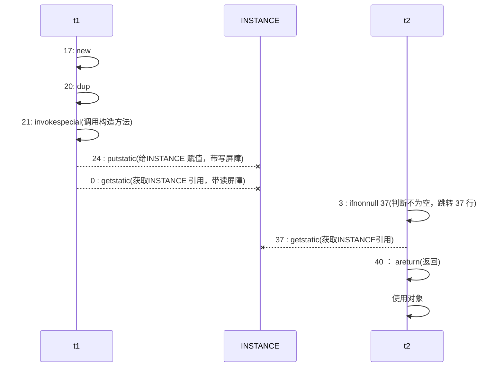

# 深入理解Java内存模型

>在学习JUC的时候，原子性、有序性、可见性贯穿我们整个学习周期

JVM 会在不影响正确性的前提下，可以调整语句的执行顺序，思考下面一段代码

```java
static int i;
static int j;
// 在某个线程内执行如下赋值操作
i = ...; 
j = ...; 
```

可以看到，至于是先执行 i 还是 先执行 j ，对最终的结果不会产生影响。所以，上面代码真正执行时，既可以是

```java
i = ...; 
j = ...;
```

也可以是

```java
j = ...;
i = ...; 
```

这种特性称之为『指令重排』，多线程下『指令重排』会影响正确性。

## 1. 从CPU层面理解指令重排序

>为什么要有重排指令这项优化呢？从 CPU 执行指令的原理来理解一下吧

### 1.1 鱼罐头加工的故事

首先我们先看一个鱼罐头加工的故事：现在我们需要加工🐟，假定加工一条鱼需要 50 分钟，只能一条鱼、一条鱼顺序加工...

我们可以将加工🐟的工人想成`CPU`，加工🐟的过程想成是`CPU`需要执行的指令，我们的加工流程如下:


我们可以发现这样一条指令一条指令的执行，效率未免太低了，那如何改进呢？

现实生活中加工鱼罐头都是`流水线`进行，会将加工一条🐟的过程分为很多步骤，通过流水线作业来提高生产效率

这里我们可以将每个鱼罐头的加工流程细分为 5 个步骤： 

- 去鳞清洗 10分钟 
- 蒸煮沥水 10分钟 
- 加注汤料 10分钟 
- 杀菌出锅 10分钟 
- 真空封罐 10分钟

读者可能会有疑问，这不还是五十分钟嘛？别急，请接着往下看


可能有的同学看到上面的图马上就能看的出来这不就是`计算机组成原理里面的流水线`吗？？？

当年老师讲过、期末考试还考过（可能还错过🤣），还是计算题大题😂，我在附录里放了几道我参加软考时做的几道流水线计算题，有兴趣的读者可以去重温一下青春😜

总而言之、言而总之，通过拆分任务再利用流水线处理，能够大大加快效率。就像是大家在开发过程中，刚刚提测，下一个需求就又来了，核心思想就是不能让你闲着🤣。我们可以在下一小节在Java多线程指令重排序优化中感受到

### 1.2 指令重排序优化

事实上，现代处理器会设计为一个时钟周期完成一条执行时间最长的 CPU 指令。为什么这么做呢？可以想到指令还可以再划分成一个个

更小的阶段，例如，每条指令都可以分为： `取指令 - 指令译码 - 执行指令 - 内存访问 - 数据写回` 这 5 个阶段


>术语参考:
>
>- instruction fetch (IF) 
>- instruction decode (ID) 
>- execute (EX) 
>- memory access (MEM) 
>- register write back (WB)

### 1.3 支持流水线的处理器

**现代 CPU 支持多级指令流水线**，例如支持同时执行 `取指令 - 指令译码 - 执行指令 - 内存访问 - 数据写回` 的处理器，就可以称之为`五级指令流水线`。这时 CPU 可以在一个时钟周期内，同时运行五条指令的不同阶段（相当于一 条执行时间最长的复杂指令），IPC = 1，本质上，流水线技术并不能缩短单条指令的执行时间，但它变相地提高了 指令地吞吐率


在不改变程序结果的前提下，这些指令的各个阶段可以通过`重排序`和`组合`来**实现指令级并行**，这一技术在 80's 中 叶到 90's 中叶占据了计算架构的重要地位，显然这并不是什么新的概念

**到这里就可以回答一下为什么要有指令重排序了——因为分阶段，分工是提升效率的关键，重排序就是为了提高多核CPU的执行效率！**

当然，指令重排的前提是，重排指令不能影响结果，例如：

```java
// 可以重排的例子
int a = 10; // 指令1
int b = 20; // 指令2
System.out.println( a + b );

// 不能重排的例子
int a = 10; // 指令1
int b = a - 5; // 指令2
```

可能看到这里读者还是不能理解Java指令重排序和操作系统的优化到底有什么关系，我们继续往下看

### 1.4 指令重排序导致的异常

我们看下面这段诡异的代码：

```java
int num = 0;
boolean ready = false;
// 线程1 执行此方法
public void actor1(I_Result r) {
     if(ready) {
     	r.r1 = num + num;
     } else {
     	r.r1 = 1;
     }
}
// 线程2 执行此方法
public void actor2(I_Result r) { 
     num = 2;
     ready = true; 
}
```

I_Result 是一个对象，有一个属性 r1 用来保存结果，问，可能的结果有几种？

可以看到，在线程二执行的过程中，ready还么为true、要么为false，为true的时候显然num = 2，那么线程一中`r.r1` = 2 + 2 = 4

如果为false，`r.r1` = 1

但是其实还会有第三种情况，就是`r.r1` = 0，因为第13、14行代码有可能发生`指令重排序`，执行的顺序会重排序，导致第十四行在第十三行之前执行

在线程二中，其实是没有任何问题的，因为这两条指令没有`数据依赖性`，单线程下重排序确实不会有任何问题，但是问题就在于多线程下这两条指令的运行顺序会影响线程一的结果，及如果ready = true先执行，线程一可能直接就执行`r.r1 = num + num`这一行代码了，而此时，num可能还没有被线程二更新，这样就会导致结果为0

>这种现象叫做指令重排，是 JIT 编译器在运行时的一些优化，这个现象需要通过大量测试才能复现：

借助 java 并发压测工具 jcstress https://wiki.openjdk.java.net/display/CodeTools/jcstress     

我们可以看到异常的现象，详细使用步骤请看：<a href="https://blog.csdn.net/Jfound/article/details/106443593?ops_request_misc=%257B%2522request%255Fid%2522%253A%2522165227912316782391875711%2522%252C%2522scm%2522%253A%252220140713.130102334..%2522%257D&request_id=165227912316782391875711&biz_id=0&utm_medium=distribute.pc_search_result.none-task-blog-2~all~sobaiduend~default-1-106443593-null-null.142^v9^control,157^v4^control&utm_term=jcstress+&spm=1018.2226.3001.4187">3.JUC整理笔记三之测试工具jcstress</a>

```css
mvn archetype:generate -DinteractiveMode=false -DarchetypeGroupId=org.openjdk.jcstress -DarchetypeArtifactId=jcstress-java-test-archetype -DarchetypeVersion=0.5 -DgroupId=cn.itcast -DartifactId=ordering -Dversion=1.0 
```

我们新建一个maven工程，在终端中执行上面的代码就可以生成一个子项目


接着将这个生成的项目导入到自己的工程中


在创建 maven 项目，提供如下测试类

```java
@JCStressTest
@Outcome(id = {"1", "4"}, expect = Expect.ACCEPTABLE, desc = "ok")
@Outcome(id = "0", expect = Expect.ACCEPTABLE_INTERESTING, desc = "!!!!")
@State
public class ConcurrencyTest {
 int num = 0;
 boolean ready = false;
   	@Actor
     public void actor1(I_Result r) {
         if(ready) {
         r.r1 = num + num;
     } else {
     	r.r1 = 1;
     	}
     }
     @Actor
     public void actor2(I_Result r) {
     	num = 2;
     	ready = true;
     }
}

```

我们将上述代码拷贝到项目中的测试类中（就一个测试类）


解释一下测试类，下面的俩个注解表示预期的结果，第一个表示正常情况下，第二个注解用特殊的字段标记，表示是我们感兴趣的结果

```java
@Outcome(id = {"1", "4"}, expect = Expect.ACCEPTABLE, desc = "ok")
@Outcome(id = "0", expect = Expect.ACCEPTABLE_INTERESTING, desc = "!!!!")
```

测试类需要先打成`jar`包才能运行，可以直接在右边maven插件里面打包


执行

```java
mvn clean install 
java -jar target/jcstress.jar
```


它会用很多线程并发执行我们的测试代码，然后就会输出我们感兴趣的内容


>可以看到只有经过上亿次的并发测试才可能捕捉到指令重排序的现象

那我们如何禁止指令重排序呢？很简单，使用我们的`volatile`关键字就可以了，它可以保证线程可见性和禁止指令重排序

我们重新打包并再次测试一下


## 2. volatile原理

如果对Java内存模型和volatile关键字完全不了解请看我之前的文章

- <a href="https://blog.csdn.net/fengxiandada/article/details/122735044">多线程学习五、volatile可见性与缓存不一致问题、指令重排序问题</a>
- <a href="https://blog.csdn.net/fengxiandada/article/details/122749566">多线程学习六、Java并发编程三大特征：原子性、可见性、有序性以及volatile保证操作可见性的进一步分析</a>
- <a href="https://blog.csdn.net/fengxiandada/article/details/123405001?csdn_share_tail=%7B%22type%22%3A%22blog%22%2C%22rType%22%3A%22article%22%2C%22rId%22%3A%22123405001%22%2C%22source%22%3A%22fengxiandada%22%7D&ctrtid=xZSmq">Java内存模型（JMM）学习一、Java内存模型的抽象结构&指令重排序</a>

这里的内容为深入理解volatile的工作原理，一些基本的概念不会过度赘述

我们知道`volatile`是通过内存屏障来解决指令重排序的，Memory Barrier（Memory Fence）

具体操作为：

- 对 volatile 变量的写指令后会加入写屏障 
- 对 volatile 变量的读指令前会加入读屏障

### 2.1 保证可见性

`volatile `从两个方面保证可见性

- 首先，`volatile`修饰的变量会在所有该变量的写操作后添加一个`写屏障`，写屏障（sfence）保证在该屏障之前的，对共享变量的改动，都同步到主存当中	

  ```java
  public void actor2(I_Result r) {
   num = 2;
   ready = true; // ready 是 volatile 赋值带写屏障
   // 写屏障
  }
  ```

  写屏障是加载`volatile`修饰变量写操作之后的，写屏障的效果是在`屏障之前的所有赋值`（写操作）都会被立刻刷新到主存中

  即会将第二行和第三行都同步到主存中

- 其次，会在所有的`volatile`读之前添加一个`读屏障`，而读屏障（lfence）保证在该屏障之后，对共享变量的读取，加载的是主存中最新数据

  ```java
  public void actor1(I_Result r) {
   // 读屏障
   // ready 是 volatile 读取值带读屏障
       if(ready) {
       	r.r1 = num + num;
       } else {
      	 r.r1 = 1;
       }
  }
  ```

  比如说ready在读屏障之后，他就不会去读工作内存中的变量，而是会去直接读主存中的变量

我们用时序图描述一下上面的两个代码片段：


>小结：
>
>在volatile变量的写指令后会加上写屏障；写屏障保证了在该屏障之前，对共享变量的改变都同步到主存中； 
>
>在volatile变量的读指令前会加上读屏障；读屏障保证了在该屏障之后，读取都是主存中最新数据

### 2.2 保证有序性

我们继续看之前的代码

- 写屏障除了保证可见性之外，还会确保指令重排序时，不会将写屏障之前的代码排在写屏障之后

  ```java
  public void actor2(I_Result r) {
   num = 2;
   ready = true; // ready 是 volatile 赋值带写屏障
   // 写屏障
  }
  ```

- 读屏障会确保指令重排序时，不会将读屏障之后的代码排在读屏障之前

  ```java
  public void actor1(I_Result r) {
       // 读屏障
       // ready 是 volatile 读取值带读屏障
       if(ready) {
       	r.r1 = num + num;
       } else {
      	 r.r1 = 1;
       }
  }
  ```

  

### 2.3 指令交错

那么保证了可见性和有序性后就没有问题了吗？其实还有问题，那就是指令交错的问题，我们看下面的图


首先我们要知道前面提到的`写屏障`和`读屏障`保证的是单个线程，也就是`volatile`变量所在的线程不允许指令重排和直接从主存中读取数据

如上图所示，其他线程例如`t2线程`并不知道`t1`线程什么时候将`volatile变量`写回到了主存中，这里就存在着指令集交错的情况，即`t2`线程读取到了`t1`线程写操作之前的数据，这样同样会带来问题

所以

- 写屏障仅仅是保证之后的读能够读到最新的结果，但不能保证读跑到它前面去 
- 而有序性的保证也只是保证了本线程内相关代码不被重排序

### 2.4 double-checked locking 问题

单例模式有很多实现方式：懒汉式、饿汉式、双检锁/双重校验锁、登记式/静态内部类、枚举

以著名的 double-checked locking 单例模式为例

```java
public class Singleton {
    private Singleton() { }
    private static Singleton INSTANCE = null;
    public static Singleton getInstance() {
        if(INSTANCE == null) { // t2
            // 首次访问会同步，而之后的使用没有 synchronized
            synchronized(Singleton.class) {
                if (INSTANCE == null) { // t1
                    INSTANCE = new Singleton();
                }
            }
        }
        return INSTANCE;
    }
}
```

以上的实现特点是：

- 懒惰实例化 
- 首次使用 getInstance() 才使用 synchronized 加锁，后续使用时无需加锁 
- **有隐含的，但很关键的一点：第一个 if 使用了 INSTANCE 变量，是在同步块之外**

上面的代码看上去好像并没有什么问题，使用双重检测锁既防止多次进入`synchronized`耗费性能，又能有效的防止多线程下多次实例化的问题。但是其实上面的代码还是有问题的，那就是`第五行和第十三行可能会发生指令重排序`

getInstance 方法对应的字节码为：

```java
0: getstatic #2 // 对应第五行代码，获取INSTANCE变量
3: ifnonnull 37 // 判断是否为null，不为null跳转到第37行
6: ldc #3       // 因为加锁需要获得类对象，所以这里为获得类对象
8: dup          // 将类对象引用复制了一份
9: astore_0     // 将类对象的引用指针存储了一份，为了之后解锁时使用
10: monitorenter // 进入同步代码块
11: getstatic #2 // 对应第五行代码，获取INSTANCE变量
14: ifnonnull 27
17: new #3       // 生成一个INSTANCE实例
20: dup          // 复制了一份INSTANCE的实例的引用
21: invokespecial #4 // 利用上一步复制的引用调用实例的构造方法
24: putstatic #2     // 赋值给INSTANCE变量
27: aload_0        
28: monitorexit  // 退出同步块,将lock对象MarkWord重置，唤醒EntryList
29: goto 37       
32: astore_1     // e -> slot 2    异常处理开始
33: aload_0      // <- lock引用
34: monitorexit  // 退出同步代码块	
35: aload_1
36: athrow       // 将处理不了的异常抛出
37: getstatic #2 // 对应第五行代码，获取INSTANCE变量
40: areturn
```

其中我们主要需要关注的是：

- 17 表示创建对象，将对象引用入栈 // new Singleton 
- 20 表示复制一份对象引用 // 引用地址 
- 21 表示利用一个对象引用，调用构造方法 
- 24 表示利用一个对象引用，赋值给 static INSTANCE

也许 jvm 会优化为：先执行 24，再执行 21（因为INSTANCE并没有完全在`synchronized`的保护之下，所以还是可能会有重排序）

如果两个线程 t1，t2 按如下时间序列执行


关键在于 `0: getstatic` 这行代码在 monitor 控制之外，在并发场景下可能会越过 monitor 读取 INSTANCE 变量的值 这时 t1 还未完全将构造方法执行完毕，如果在构造方法中要执行很多初始化操作，那么 t2 拿到的是将是一个未初始化完毕的单例

那如何解决呢？其实很简单，对 INSTANCE 使用 volatile 修饰即可，可以禁用指令重排，但要注意在 JDK 5 以上的版本的 volatile 才会真正有效

### 2.5 double-checked locking 解决

```java
public class Singleton {
    private Singleton() { }
    private static volatile Singleton INSTANCE = null;
    public static Singleton getInstance() {
        if(INSTANCE == null) { // t2
            // 首次访问会同步，而之后的使用没有 synchronized
            synchronized(Singleton.class) {
                if (INSTANCE == null) { // t1
                    INSTANCE = new Singleton();
                }
            }
        }
        return INSTANCE;
    }
}
```

字节码上看不出来 volatile 指令的效果

```java
// -------------------------------------> 加入对 INSTANCE 变量的读屏障
0: getstatic #2 // Field INSTANCE:Lcn/itcast/n5/Singleton;
3: ifnonnull 37
6: ldc #3 // class cn/itcast/n5/Singleton
8: dup
9: astore_0
10: monitorenter -----------------------> 保证原子性、可见性
11: getstatic #2 // Field INSTANCE:Lcn/itcast/n5/Singleton;
14: ifnonnull 27
17: new #3 // class cn/itcast/n5/Singleton
20: dup
21: invokespecial #4 // Method "<init>":()V
24: putstatic #2 // Field INSTANCE:Lcn/itcast/n5/Singleton;
// -------------------------------------> 加入对 INSTANCE 变量的写屏障
27: aload_0
28: monitorexit ------------------------> 保证原子性、可见性
29: goto 37
32: astore_1
33: aload_0
34: monitorexit
35: aload_1
36: athrow
37: getstatic #2 // Field INSTANCE:Lcn/itcast/n5/Singleton;
40: areturn    
```

如上面的注释内容所示，读写 volatile 变量时会加入内存屏障（Memory Barrier（Memory Fence）），保证下面两点：

- 可见性
  - 写屏障（sfence）保证在该屏障之前的 t1 对共享变量的改动，都同步到主存当中 
  - 而读屏障（lfence）保证在该屏障之后 t2 对共享变量的读取，加载的是主存中最新数据
- 有序性
  - 写屏障会确保指令重排序时，不会将写屏障之前的代码排在写屏障之后 
  - 读屏障会确保指令重排序时，不会将读屏障之后的代码排在读屏障之前
- 更底层是读写变量时使用 lock 指令来多核 CPU 之间的可见性与有序性



### 2.6 happens-before

happens-before 规定了对共享变量的写操作对其它线程的读操作可见，它是可见性与有序性的一套规则总结，抛开以下 happens-before 规则，JMM 并不能保证一个线程对共享变量的写，对于其它线程对该共享变量的读可见

这里一共总结了七个规则

- 线程解锁 m 之前对变量的写，对于接下来对 m 加锁的其它线程对该变量的读可见

  ```java
  static int x;
  static Object m = new Object();
  
  new Thread(()->{
       synchronized(m) {
           x = 10;
      }
  },"t1").start();
  
  new Thread(()->{
       synchronized(m) {
          System.out.println(x);
       }
  },"t2").start();
  ```

- 线程对 volatile 变量的写，对接下来其它线程对该变量的读可见

  ```java
  volatile static int x;
  new Thread(()->{
       x = 10;
  },"t1").start();
  
  new Thread(()->{
       System.out.println(x);
  },"t2").start();
  ```

- 线程 start 前对变量的写，对该线程开始后对该变量的读可见

  ```java
  static int x;
      x = 10;
  new Thread(()->{
       System.out.println(x);
  },"t2").start();
  ```

- 线程结束前对变量的写，对其它线程得知它结束后的读可见（比如其它线程调用 t1.isAlive() 或 t1.join()等待 它结束）

  ```java
  static int x;
  Thread t1 = new Thread(()->{
       x = 10;
  },"t1");
  
  t1.start();
  t1.join();
  System.out.println(x);
  ```

- 线程 t1 打断 t2（interrupt）前对变量的写，对于其他线程得知 t2 被打断后对变量的读可见（通过 t2.interrupted 或 t2.isInterrupted）

  ```java
  static int x;
  public static void main(String[] args) {
   Thread t2 = new Thread(()->{
       while(true) {
           if(Thread.currentThread().isInterrupted()) {
               System.out.println(x);
               break;
           }
       }
   },"t2");
      
   t2.start();
       new Thread(()->{
           sleep(1);
           x = 10;
           t2.interrupt();
       },"t1").start();
      
   	while(!t2.isInterrupted()) {
           Thread.yield();
       }
       System.out.println(x);
  }
  
  ```

- 对变量默认值（0，false，null）的写，对其它线程对该变量的读可见 

- 具有传递性，如果 x hb-> y 并且 y hb-> z 那么有 x hb-> z ，配合 volatile 的防指令重排，有下面的例子

  ```java
  volatile static int x;
  static int y;
  
  new Thread(()->{ 
       y = 10;
       x = 20;
  },"t1").start();
  
  new Thread(()->{
       // x=20 对 t2 可见, 同时 y=10 也对 t2 可见
       System.out.println(x); 
  },"t2").start();
  
  ```


## 3. final

### 3.1 设置 final 变量的原理

理解了 volatile 原理，再对比 final 的实现就比较简单了

```java
public class TestFinal {
     final int a = 20;
}
```

对应字节码为：

```java
0: aload_0
1: invokespecial #1 // Method java/lang/Object."<init>":()V
4: aload_0
5: bipush 20
7: putfield #2 // Field a:I
 <-- 写屏障
10: return
```

发现 final 变量的赋值也会通过 putfield 指令来完成，同样在这条指令之后也会加入写屏障，保证在其它线程读到 它的值时不会出现为 0 的情况

### 3.2 获取 final 变量的原理

final 变量在获取时并不是去主存中获取共享变量，而是将栈中的变量复制了一份，这样就保证了线程之间数据的安全性

对应字节码为：

```java
// class version 52.0 (52)
// access flags 0x21
public class com/fx/atomic/Test9_final {

  // compiled from: Test9_final.java

  // access flags 0x1
  public <init>()V
   L0
    LINENUMBER 8 L0
    ALOAD 0
    INVOKESPECIAL java/lang/Object.<init> ()V
    RETURN
   L1
    LOCALVARIABLE this Lcom/fx/atomic/Test9_final; L0 L1 0
    MAXSTACK = 1
    MAXLOCALS = 1

  // access flags 0x9
  public static main([Ljava/lang/String;)V
   L0
    LINENUMBER 10 L0
    ICONST_0
    ISTORE 1
   L1
    LINENUMBER 11 L1
    GETSTATIC java/lang/System.out : Ljava/io/PrintStream;
    ILOAD 1
    INVOKEVIRTUAL java/io/PrintStream.println (I)V
   L2
    LINENUMBER 12 L2
    RETURN
   L3
    LOCALVARIABLE args [Ljava/lang/String; L0 L3 0
    LOCALVARIABLE a I L1 L3 1
    MAXSTACK = 2
    MAXLOCALS = 2
}

```


## 附录：流水线期末考试计算大题

没想到还真有人来回忆青春哈🤣，先复习一下，不然等下看到题目一脸懵😵

### 流水线技术（必考流水线的相关计算）

- 流水线概念：流水线是指在程序执行时多条指令重叠进行操作的一种准并行处理时限技术。各种部件同时处理是针对不同指令而言的，它们可同时为多条指令的不同部分进行工作，以提高各部件的利用率和指令的平均执行速度
- 流水线处理过程：取指、分析、执行

### 流水线的计算

计算概念：

- 流水线周期：流水线周期（Δt）为执行时间最长的一段
- 流水线计算公式：1条指令执行时间    +（指令条数-1）*   流水线周期

​      1.理论公式：（t1+t2+…+tk）+(n-1)*Δt（考试一般是理论公式）

​      2.实践公式：（k+n-1）*Δt（考试也可能是实践公式，k为一条指令分的段数）

### 例题

若指令流水线把一条指令分为取指、分析、和执行三部分，且三部分的时间分别是取2ns、2ns、1ns。那么，流水线周期是多少？100条指令全部执行完毕需要的时间是多少？TP和TP（max）分别是多少？加速比是多少？效率如何？

### 题解


解：流水线周期=最长的一段=2ns

​         理论公式：time=(2+2+1)+(100-1)*2=203

​         实践公式：time=(3+100-1)*2=204

### 流水线吞吐率计算

计算概念：

- 流水线吞吐量（Though Put rate，TP）：指在单位时间内流水线所完成的任务数量或输出的结果数量
- 基本公式：TP=指令条数/流水线执行时间

- 流水线最大吞吐率：TP（max）=lim(n->∞)n/（k+n-1）*Δt=1/Δt（即理想化的处理，每一个流水线周期都会完成一条指令）

例题：求上面例题中的TP和TP（max）

解：TP=100/203

​       TP（max）=1/2

### 流水线加速比计算

计算概念：

- 流水线加速比：完成同样一批任务，不使用流水线所用的时间与使用流水线所用的时间之比
- 基本公式：S=不使用流水线执行时间/使用流水线执行时间

例题：上述例题的流水线加速比？

解：s=(2+2+1)*100/[(2+2+1)+(100-1)*2]=500/203

**可以看到流水线加速比s越大越好**

