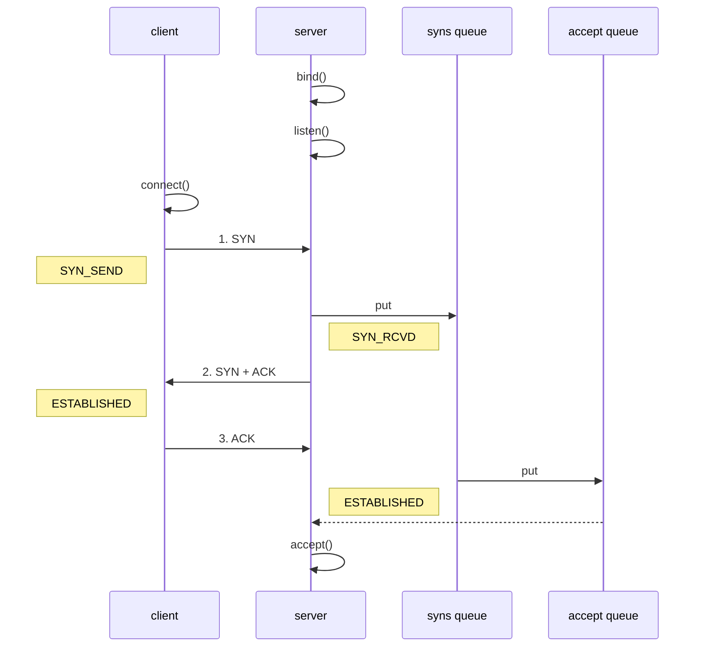

# 四. 优化与源码

## 1. 优化

### 1.1 扩展序列化算法

序列化，反序列化主要用在消息正文的转换上

* 序列化时，需要将 Java 对象变为要传输的数据（可以是 byte[]，或 json 等，最终都需要变成 byte[]）
* 反序列化时，需要将传入的正文数据还原成 Java 对象，便于处理

目前的代码仅支持 Java 自带的序列化，反序列化机制，核心代码如下

```java
// 反序列化
byte[] body = new byte[bodyLength];
byteByf.readBytes(body);
ObjectInputStream in = new ObjectInputStream(new ByteArrayInputStream(body));
Message message = (Message) in.readObject();
message.setSequenceId(sequenceId);

// 序列化
ByteArrayOutputStream out = new ByteArrayOutputStream();
new ObjectOutputStream(out).writeObject(message);
byte[] bytes = out.toByteArray();
```

为了支持更多序列化算法，抽象一个 Serializer 接口

```java
public interface Serializer {

    // 反序列化方法
    <T> T deserialize(Class<T> clazz, byte[] bytes);

    // 序列化方法
    <T> byte[] serialize(T object);

}
```

提供两个实现，我这里直接将实现加入了枚举类 Serializer.Algorithm 中

```java
enum SerializerAlgorithm implements Serializer {
	// Java 实现
    Java {
        @Override
        public <T> T deserialize(Class<T> clazz, byte[] bytes) {
            try {
                ObjectInputStream in = 
                    new ObjectInputStream(new ByteArrayInputStream(bytes));
                Object object = in.readObject();
                return (T) object;
            } catch (IOException | ClassNotFoundException e) {
                throw new RuntimeException("SerializerAlgorithm.Java 反序列化错误", e);
            }
        }

        @Override
        public <T> byte[] serialize(T object) {
            try {
                ByteArrayOutputStream out = new ByteArrayOutputStream();
                new ObjectOutputStream(out).writeObject(object);
                return out.toByteArray();
            } catch (IOException e) {
                throw new RuntimeException("SerializerAlgorithm.Java 序列化错误", e);
            }
        }
    }, 
    // Json 实现(引入了 Gson 依赖)
    Json {
        @Override
        public <T> T deserialize(Class<T> clazz, byte[] bytes) {
            return new Gson().fromJson(new String(bytes, StandardCharsets.UTF_8), clazz);
        }

        @Override
        public <T> byte[] serialize(T object) {
            return new Gson().toJson(object).getBytes(StandardCharsets.UTF_8);
        }
    };

    // 需要从协议的字节中得到是哪种序列化算法
    public static SerializerAlgorithm getByInt(int type) {
        SerializerAlgorithm[] array = SerializerAlgorithm.values();
        if (type < 0 || type > array.length - 1) {
            throw new IllegalArgumentException("超过 SerializerAlgorithm 范围");
        }
        return array[type];
    }
}
```


增加配置类和配置文件

```java
public abstract class Config {
    static Properties properties;
    static {
        try (InputStream in = Config.class.getResourceAsStream("/application.properties")) {
            properties = new Properties();
            properties.load(in);
        } catch (IOException e) {
            throw new ExceptionInInitializerError(e);
        }
    }
    public static int getServerPort() {
        String value = properties.getProperty("server.port");
        if(value == null) {
            return 8080;
        } else {
            return Integer.parseInt(value);
        }
    }
    public static Serializer.Algorithm getSerializerAlgorithm() {
        String value = properties.getProperty("serializer.algorithm");
        if(value == null) {
            return Serializer.Algorithm.Java;
        } else {
            return Serializer.Algorithm.valueOf(value);
        }
    }
}
```


配置文件

```properties
serializer.algorithm=Json
```


修改编解码器

```java
/**
 * 必须和 LengthFieldBasedFrameDecoder 一起使用，确保接到的 ByteBuf 消息是完整的
 */
public class MessageCodecSharable extends MessageToMessageCodec<ByteBuf, Message> {
    @Override
    public void encode(ChannelHandlerContext ctx, Message msg, List<Object> outList) throws Exception {
        ByteBuf out = ctx.alloc().buffer();
        // 1. 4 字节的魔数
        out.writeBytes(new byte[]{1, 2, 3, 4});
        // 2. 1 字节的版本,
        out.writeByte(1);
        // 3. 1 字节的序列化方式 jdk 0 , json 1
        out.writeByte(Config.getSerializerAlgorithm().ordinal());
        // 4. 1 字节的指令类型
        out.writeByte(msg.getMessageType());
        // 5. 4 个字节
        out.writeInt(msg.getSequenceId());
        // 无意义，对齐填充
        out.writeByte(0xff);
        // 6. 获取内容的字节数组
        byte[] bytes = Config.getSerializerAlgorithm().serialize(msg);
        // 7. 长度
        out.writeInt(bytes.length);
        // 8. 写入内容
        out.writeBytes(bytes);
        outList.add(out);
    }

    @Override
    protected void decode(ChannelHandlerContext ctx, ByteBuf in, List<Object> out) throws Exception {
        int magicNum = in.readInt();
        byte version = in.readByte();
        byte serializerAlgorithm = in.readByte(); // 0 或 1
        byte messageType = in.readByte(); // 0,1,2...
        int sequenceId = in.readInt();
        in.readByte();
        int length = in.readInt();
        byte[] bytes = new byte[length];
        in.readBytes(bytes, 0, length);

        // 找到反序列化算法
        Serializer.Algorithm algorithm = Serializer.Algorithm.values()[serializerAlgorithm];
        // 确定具体消息类型
        Class<? extends Message> messageClass = Message.getMessageClass(messageType);
        Message message = algorithm.deserialize(messageClass, bytes);
//        log.debug("{}, {}, {}, {}, {}, {}", magicNum, version, serializerType, messageType, sequenceId, length);
//        log.debug("{}", message);
        out.add(message);
    }
}
```


其中确定具体消息类型，可以根据 `消息类型字节` 获取到对应的 `消息 class`

```java
@Data
public abstract class Message implements Serializable {

    /**
     * 根据消息类型字节，获得对应的消息 class
     * @param messageType 消息类型字节
     * @return 消息 class
     */
    public static Class<? extends Message> getMessageClass(int messageType) {
        return messageClasses.get(messageType);
    }

    private int sequenceId;

    private int messageType;

    public abstract int getMessageType();

    public static final int LoginRequestMessage = 0;
    public static final int LoginResponseMessage = 1;
    public static final int ChatRequestMessage = 2;
    public static final int ChatResponseMessage = 3;
    public static final int GroupCreateRequestMessage = 4;
    public static final int GroupCreateResponseMessage = 5;
    public static final int GroupJoinRequestMessage = 6;
    public static final int GroupJoinResponseMessage = 7;
    public static final int GroupQuitRequestMessage = 8;
    public static final int GroupQuitResponseMessage = 9;
    public static final int GroupChatRequestMessage = 10;
    public static final int GroupChatResponseMessage = 11;
    public static final int GroupMembersRequestMessage = 12;
    public static final int GroupMembersResponseMessage = 13;
    public static final int PingMessage = 14;
    public static final int PongMessage = 15;
    private static final Map<Integer, Class<? extends Message>> messageClasses = new HashMap<>();

    static {
        messageClasses.put(LoginRequestMessage, LoginRequestMessage.class);
        messageClasses.put(LoginResponseMessage, LoginResponseMessage.class);
        messageClasses.put(ChatRequestMessage, ChatRequestMessage.class);
        messageClasses.put(ChatResponseMessage, ChatResponseMessage.class);
        messageClasses.put(GroupCreateRequestMessage, GroupCreateRequestMessage.class);
        messageClasses.put(GroupCreateResponseMessage, GroupCreateResponseMessage.class);
        messageClasses.put(GroupJoinRequestMessage, GroupJoinRequestMessage.class);
        messageClasses.put(GroupJoinResponseMessage, GroupJoinResponseMessage.class);
        messageClasses.put(GroupQuitRequestMessage, GroupQuitRequestMessage.class);
        messageClasses.put(GroupQuitResponseMessage, GroupQuitResponseMessage.class);
        messageClasses.put(GroupChatRequestMessage, GroupChatRequestMessage.class);
        messageClasses.put(GroupChatResponseMessage, GroupChatResponseMessage.class);
        messageClasses.put(GroupMembersRequestMessage, GroupMembersRequestMessage.class);
        messageClasses.put(GroupMembersResponseMessage, GroupMembersResponseMessage.class);
    }
}
```


### 1.2 参数调优

#### 1）CONNECT_TIMEOUT_MILLIS

* 属于 SocketChannal 参数
* 用在客户端建立连接时，如果在指定毫秒内无法连接，会抛出 timeout 异常

* SO_TIMEOUT 主要用在阻塞 IO，阻塞 IO 中 accept，read 等都是无限等待的，如果不希望永远阻塞，使用它调整超时时间

```java
@Slf4j
public class TestConnectionTimeout {
    public static void main(String[] args) {
        NioEventLoopGroup group = new NioEventLoopGroup();
        try {
            Bootstrap bootstrap = new Bootstrap()
                    .group(group)
                    .option(ChannelOption.CONNECT_TIMEOUT_MILLIS, 300)
                    .channel(NioSocketChannel.class)
                    .handler(new LoggingHandler());
            ChannelFuture future = bootstrap.connect("127.0.0.1", 8080);
            future.sync().channel().closeFuture().sync(); // 断点1
        } catch (Exception e) {
            e.printStackTrace();
            log.debug("timeout");
        } finally {
            group.shutdownGracefully();
        }
    }
}
```

另外源码部分 `io.netty.channel.nio.AbstractNioChannel.AbstractNioUnsafe#connect`

```java
@Override
public final void connect(
        final SocketAddress remoteAddress, final SocketAddress localAddress, final ChannelPromise promise) {
    // ...
    // Schedule connect timeout.
    int connectTimeoutMillis = config().getConnectTimeoutMillis();
    if (connectTimeoutMillis > 0) {
        connectTimeoutFuture = eventLoop().schedule(new Runnable() {
            @Override
            public void run() {                
                ChannelPromise connectPromise = AbstractNioChannel.this.connectPromise;
                ConnectTimeoutException cause =
                    new ConnectTimeoutException("connection timed out: " + remoteAddress); // 断点2
                if (connectPromise != null && connectPromise.tryFailure(cause)) {
                    close(voidPromise());
                }
            }
        }, connectTimeoutMillis, TimeUnit.MILLISECONDS);
    }
	// ...
}
```


#### 2）SO_BACKLOG

* 属于 ServerSocketChannal 参数



1. 第一次握手，client 发送 SYN 到 server，状态修改为 SYN_SEND，server 收到，状态改变为 SYN_REVD，并将该请求放入 sync queue 队列
2. 第二次握手，server 回复 SYN + ACK 给 client，client 收到，状态改变为 ESTABLISHED，并发送 ACK 给 server
3. 第三次握手，server 收到 ACK，状态改变为 ESTABLISHED，将该请求从 sync queue 放入 accept queue

其中

* 在 linux 2.2 之前，backlog 大小包括了两个队列的大小，在 2.2 之后，分别用下面两个参数来控制

* sync queue - 半连接队列
  * 大小通过 /proc/sys/net/ipv4/tcp_max_syn_backlog 指定，在 `syncookies` 启用的情况下，逻辑上没有最大值限制，这个设置便被忽略
* accept queue - 全连接队列
  * 其大小通过 /proc/sys/net/core/somaxconn 指定，在使用 listen 函数时，内核会根据传入的 backlog 参数与系统参数，取二者的较小值
  * 如果 accpet queue 队列满了，server 将发送一个拒绝连接的错误信息到 client


netty 中

可以通过  option(ChannelOption.SO_BACKLOG, 值) 来设置大小


可以通过下面源码查看默认大小

```java
public class DefaultServerSocketChannelConfig extends DefaultChannelConfig
                                              implements ServerSocketChannelConfig {

    private volatile int backlog = NetUtil.SOMAXCONN;
    // ...
}
```


课堂调试关键断点为：`io.netty.channel.nio.NioEventLoop#processSelectedKey`


oio 中更容易说明，不用 debug 模式

```java
public class Server {
    public static void main(String[] args) throws IOException {
        ServerSocket ss = new ServerSocket(8888, 2);
        Socket accept = ss.accept();
        System.out.println(accept);
        System.in.read();
    }
}
```

客户端启动 4 个

```java
public class Client {
    public static void main(String[] args) throws IOException {
        try {
            Socket s = new Socket();
            System.out.println(new Date()+" connecting...");
            s.connect(new InetSocketAddress("localhost", 8888),1000);
            System.out.println(new Date()+" connected...");
            s.getOutputStream().write(1);
            System.in.read();
        } catch (IOException e) {
            System.out.println(new Date()+" connecting timeout...");
            e.printStackTrace();
        }
    }
}
```

第 1，2，3 个客户端都打印，但除了第一个处于 accpet 外，其它两个都处于 accept queue 中

```java
Tue Apr 21 20:30:28 CST 2020 connecting...
Tue Apr 21 20:30:28 CST 2020 connected...
```

第 4 个客户端连接时

```
Tue Apr 21 20:53:58 CST 2020 connecting...
Tue Apr 21 20:53:59 CST 2020 connecting timeout...
java.net.SocketTimeoutException: connect timed out
```


#### 3）ulimit -n

* 属于操作系统参数


#### 4）TCP_NODELAY

* 属于 SocketChannal 参数


#### 5）SO_SNDBUF & SO_RCVBUF

* SO_SNDBUF 属于 SocketChannal 参数
* SO_RCVBUF 既可用于 SocketChannal 参数，也可以用于 ServerSocketChannal 参数（建议设置到 ServerSocketChannal 上）


#### 6）ALLOCATOR

* 属于 SocketChannal 参数
* 用来分配 ByteBuf， ctx.alloc()


#### 7）RCVBUF_ALLOCATOR

* 属于 SocketChannal 参数
* 控制 netty 接收缓冲区大小
* 负责入站数据的分配，决定入站缓冲区的大小（并可动态调整），统一采用 direct 直接内存，具体池化还是非池化由 allocator 决定


### 1.3 RPC 框架

#### 1）准备工作

这些代码可以认为是现成的，无需从头编写练习

为了简化起见，在原来聊天项目的基础上新增 Rpc 请求和响应消息

```java
@Data
public abstract class Message implements Serializable {

    // 省略旧的代码

    public static final int RPC_MESSAGE_TYPE_REQUEST = 101;
    public static final int  RPC_MESSAGE_TYPE_RESPONSE = 102;

    static {
        // ...
        messageClasses.put(RPC_MESSAGE_TYPE_REQUEST, RpcRequestMessage.class);
        messageClasses.put(RPC_MESSAGE_TYPE_RESPONSE, RpcResponseMessage.class);
    }

}
```

请求消息

```java
@Getter
@ToString(callSuper = true)
public class RpcRequestMessage extends Message {

    /**
     * 调用的接口全限定名，服务端根据它找到实现
     */
    private String interfaceName;
    /**
     * 调用接口中的方法名
     */
    private String methodName;
    /**
     * 方法返回类型
     */
    private Class<?> returnType;
    /**
     * 方法参数类型数组
     */
    private Class[] parameterTypes;
    /**
     * 方法参数值数组
     */
    private Object[] parameterValue;

    public RpcRequestMessage(int sequenceId, String interfaceName, String methodName, Class<?> returnType, Class[] parameterTypes, Object[] parameterValue) {
        super.setSequenceId(sequenceId);
        this.interfaceName = interfaceName;
        this.methodName = methodName;
        this.returnType = returnType;
        this.parameterTypes = parameterTypes;
        this.parameterValue = parameterValue;
    }

    @Override
    public int getMessageType() {
        return RPC_MESSAGE_TYPE_REQUEST;
    }
}
```

响应消息

```java
@Data
@ToString(callSuper = true)
public class RpcResponseMessage extends Message {
    /**
     * 返回值
     */
    private Object returnValue;
    /**
     * 异常值
     */
    private Exception exceptionValue;

    @Override
    public int getMessageType() {
        return RPC_MESSAGE_TYPE_RESPONSE;
    }
}
```

服务器架子

```java
@Slf4j
public class RpcServer {
    public static void main(String[] args) {
        NioEventLoopGroup boss = new NioEventLoopGroup();
        NioEventLoopGroup worker = new NioEventLoopGroup();
        LoggingHandler LOGGING_HANDLER = new LoggingHandler(LogLevel.DEBUG);
        MessageCodecSharable MESSAGE_CODEC = new MessageCodecSharable();
        
        // rpc 请求消息处理器，待实现
        RpcRequestMessageHandler RPC_HANDLER = new RpcRequestMessageHandler();
        try {
            ServerBootstrap serverBootstrap = new ServerBootstrap();
            serverBootstrap.channel(NioServerSocketChannel.class);
            serverBootstrap.group(boss, worker);
            serverBootstrap.childHandler(new ChannelInitializer<SocketChannel>() {
                @Override
                protected void initChannel(SocketChannel ch) throws Exception {
                    ch.pipeline().addLast(new ProcotolFrameDecoder());
                    ch.pipeline().addLast(LOGGING_HANDLER);
                    ch.pipeline().addLast(MESSAGE_CODEC);
                    ch.pipeline().addLast(RPC_HANDLER);
                }
            });
            Channel channel = serverBootstrap.bind(8080).sync().channel();
            channel.closeFuture().sync();
        } catch (InterruptedException e) {
            log.error("server error", e);
        } finally {
            boss.shutdownGracefully();
            worker.shutdownGracefully();
        }
    }
}
```

客户端架子

```java
public class RpcClient {
    public static void main(String[] args) {
        NioEventLoopGroup group = new NioEventLoopGroup();
        LoggingHandler LOGGING_HANDLER = new LoggingHandler(LogLevel.DEBUG);
        MessageCodecSharable MESSAGE_CODEC = new MessageCodecSharable();
        
        // rpc 响应消息处理器，待实现
        RpcResponseMessageHandler RPC_HANDLER = new RpcResponseMessageHandler();
        try {
            Bootstrap bootstrap = new Bootstrap();
            bootstrap.channel(NioSocketChannel.class);
            bootstrap.group(group);
            bootstrap.handler(new ChannelInitializer<SocketChannel>() {
                @Override
                protected void initChannel(SocketChannel ch) throws Exception {
                    ch.pipeline().addLast(new ProcotolFrameDecoder());
                    ch.pipeline().addLast(LOGGING_HANDLER);
                    ch.pipeline().addLast(MESSAGE_CODEC);
                    ch.pipeline().addLast(RPC_HANDLER);
                }
            });
            Channel channel = bootstrap.connect("localhost", 8080).sync().channel();
            channel.closeFuture().sync();
        } catch (Exception e) {
            log.error("client error", e);
        } finally {
            group.shutdownGracefully();
        }
    }
}
```

服务器端的 service 获取

```java
public class ServicesFactory {

    static Properties properties;
    static Map<Class<?>, Object> map = new ConcurrentHashMap<>();

    static {
        try (InputStream in = Config.class.getResourceAsStream("/application.properties")) {
            properties = new Properties();
            properties.load(in);
            Set<String> names = properties.stringPropertyNames();
            for (String name : names) {
                if (name.endsWith("Service")) {
                    Class<?> interfaceClass = Class.forName(name);
                    Class<?> instanceClass = Class.forName(properties.getProperty(name));
                    map.put(interfaceClass, instanceClass.newInstance());
                }
            }
        } catch (IOException | ClassNotFoundException | InstantiationException | IllegalAccessException e) {
            throw new ExceptionInInitializerError(e);
        }
    }

    public static <T> T getService(Class<T> interfaceClass) {
        return (T) map.get(interfaceClass);
    }
}
```

相关配置 application.properties

```
serializer.algorithm=Json
cn.itcast.server.service.HelloService=cn.itcast.server.service.HelloServiceImpl
```


#### 2）服务器 handler

```java
@Slf4j
@ChannelHandler.Sharable
public class RpcRequestMessageHandler extends SimpleChannelInboundHandler<RpcRequestMessage> {

    @Override
    protected void channelRead0(ChannelHandlerContext ctx, RpcRequestMessage message) {
        RpcResponseMessage response = new RpcResponseMessage();
        response.setSequenceId(message.getSequenceId());
        try {
            // 获取真正的实现对象
            HelloService service = (HelloService)
                    ServicesFactory.getService(Class.forName(message.getInterfaceName()));
            
            // 获取要调用的方法
            Method method = service.getClass().getMethod(message.getMethodName(), message.getParameterTypes());
            
            // 调用方法
            Object invoke = method.invoke(service, message.getParameterValue());
            // 调用成功
            response.setReturnValue(invoke);
        } catch (Exception e) {
            e.printStackTrace();
            // 调用异常
            response.setExceptionValue(e);
        }
        // 返回结果
        ctx.writeAndFlush(response);
    }
}
```


#### 3）客户端代码第一版

只发消息

```java
@Slf4j
public class RpcClient {
    public static void main(String[] args) {
        NioEventLoopGroup group = new NioEventLoopGroup();
        LoggingHandler LOGGING_HANDLER = new LoggingHandler(LogLevel.DEBUG);
        MessageCodecSharable MESSAGE_CODEC = new MessageCodecSharable();
        RpcResponseMessageHandler RPC_HANDLER = new RpcResponseMessageHandler();
        try {
            Bootstrap bootstrap = new Bootstrap();
            bootstrap.channel(NioSocketChannel.class);
            bootstrap.group(group);
            bootstrap.handler(new ChannelInitializer<SocketChannel>() {
                @Override
                protected void initChannel(SocketChannel ch) throws Exception {
                    ch.pipeline().addLast(new ProcotolFrameDecoder());
                    ch.pipeline().addLast(LOGGING_HANDLER);
                    ch.pipeline().addLast(MESSAGE_CODEC);
                    ch.pipeline().addLast(RPC_HANDLER);
                }
            });
            Channel channel = bootstrap.connect("localhost", 8080).sync().channel();

            ChannelFuture future = channel.writeAndFlush(new RpcRequestMessage(
                    1,
                    "cn.itcast.server.service.HelloService",
                    "sayHello",
                    String.class,
                    new Class[]{String.class},
                    new Object[]{"张三"}
            )).addListener(promise -> {
                if (!promise.isSuccess()) {
                    Throwable cause = promise.cause();
                    log.error("error", cause);
                }
            });

            channel.closeFuture().sync();
        } catch (Exception e) {
            log.error("client error", e);
        } finally {
            group.shutdownGracefully();
        }
    }
}
```


#### 4）客户端 handler 第一版

```java
@Slf4j
@ChannelHandler.Sharable
public class RpcResponseMessageHandler extends SimpleChannelInboundHandler<RpcResponseMessage> {
    @Override
    protected void channelRead0(ChannelHandlerContext ctx, RpcResponseMessage msg) throws Exception {
        log.debug("{}", msg);
    }
}
```


#### 5）客户端代码 第二版

包括 channel 管理，代理，接收结果

```java
@Slf4j
public class RpcClientManager {


    public static void main(String[] args) {
        HelloService service = getProxyService(HelloService.class);
        System.out.println(service.sayHello("zhangsan"));
//        System.out.println(service.sayHello("lisi"));
//        System.out.println(service.sayHello("wangwu"));
    }

    // 创建代理类
    public static <T> T getProxyService(Class<T> serviceClass) {
        ClassLoader loader = serviceClass.getClassLoader();
        Class<?>[] interfaces = new Class[]{serviceClass};
        //                                                            sayHello  "张三"
        Object o = Proxy.newProxyInstance(loader, interfaces, (proxy, method, args) -> {
            // 1. 将方法调用转换为 消息对象
            int sequenceId = SequenceIdGenerator.nextId();
            RpcRequestMessage msg = new RpcRequestMessage(
                    sequenceId,
                    serviceClass.getName(),
                    method.getName(),
                    method.getReturnType(),
                    method.getParameterTypes(),
                    args
            );
            // 2. 将消息对象发送出去
            getChannel().writeAndFlush(msg);

            // 3. 准备一个空 Promise 对象，来接收结果             指定 promise 对象异步接收结果线程
            DefaultPromise<Object> promise = new DefaultPromise<>(getChannel().eventLoop());
            RpcResponseMessageHandler.PROMISES.put(sequenceId, promise);

//            promise.addListener(future -> {
//                // 线程
//            });

            // 4. 等待 promise 结果
            promise.await();
            if(promise.isSuccess()) {
                // 调用正常
                return promise.getNow();
            } else {
                // 调用失败
                throw new RuntimeException(promise.cause());
            }
        });
        return (T) o;
    }

    private static Channel channel = null;
    private static final Object LOCK = new Object();

    // 获取唯一的 channel 对象
    public static Channel getChannel() {
        if (channel != null) {
            return channel;
        }
        synchronized (LOCK) { //  t2
            if (channel != null) { // t1
                return channel;
            }
            initChannel();
            return channel;
        }
    }

    // 初始化 channel 方法
    private static void initChannel() {
        NioEventLoopGroup group = new NioEventLoopGroup();
        LoggingHandler LOGGING_HANDLER = new LoggingHandler(LogLevel.DEBUG);
        MessageCodecSharable MESSAGE_CODEC = new MessageCodecSharable();
        RpcResponseMessageHandler RPC_HANDLER = new RpcResponseMessageHandler();
        Bootstrap bootstrap = new Bootstrap();
        bootstrap.channel(NioSocketChannel.class);
        bootstrap.group(group);
        bootstrap.handler(new ChannelInitializer<SocketChannel>() {
            @Override
            protected void initChannel(SocketChannel ch) throws Exception {
                ch.pipeline().addLast(new ProcotolFrameDecoder());
                ch.pipeline().addLast(LOGGING_HANDLER);
                ch.pipeline().addLast(MESSAGE_CODEC);
                ch.pipeline().addLast(RPC_HANDLER);
            }
        });
        try {
            channel = bootstrap.connect("localhost", 8080).sync().channel();
            channel.closeFuture().addListener(future -> {
                group.shutdownGracefully();
            });
        } catch (Exception e) {
            log.error("client error", e);
        }
    }
}
```


#### 6）客户端 handler 第二版

```java
@Slf4j
@ChannelHandler.Sharable
public class RpcResponseMessageHandler extends SimpleChannelInboundHandler<RpcResponseMessage> {

    //                       序号      用来接收结果的 promise 对象
    public static final Map<Integer, Promise<Object>> PROMISES = new ConcurrentHashMap<>();

    @Override

    protected void channelRead0(ChannelHandlerContext ctx, RpcResponseMessage msg) throws Exception {
        log.debug("{}", msg);
        // 拿到空的 promise
        Promise<Object> promise = PROMISES.remove(msg.getSequenceId());
        if (promise != null) {
            Object returnValue = msg.getReturnValue();
            Exception exceptionValue = msg.getExceptionValue();
            if(exceptionValue != null) {
                promise.setFailure(exceptionValue);
            } else {
                promise.setSuccess(returnValue);
            }
        }
    }
}
```


## 2. 源码分析

### 2.1 启动剖析

我们就来看看 netty 中对下面的代码是怎样进行处理的

```java
//1 netty 中使用 NioEventLoopGroup （简称 nio boss 线程）来封装线程和 selector
Selector selector = Selector.open(); 

//2 创建 NioServerSocketChannel，同时会初始化它关联的 handler，以及为原生 ssc 存储 config
NioServerSocketChannel attachment = new NioServerSocketChannel();

//3 创建 NioServerSocketChannel 时，创建了 java 原生的 ServerSocketChannel
ServerSocketChannel serverSocketChannel = ServerSocketChannel.open(); 
serverSocketChannel.configureBlocking(false);

//4 启动 nio boss 线程执行接下来的操作

//5 注册（仅关联 selector 和 NioServerSocketChannel），未关注事件
SelectionKey selectionKey = serverSocketChannel.register(selector, 0, attachment);

//6 head -> 初始化器 -> ServerBootstrapAcceptor -> tail，初始化器是一次性的，只为添加 acceptor

//7 绑定端口
serverSocketChannel.bind(new InetSocketAddress(8080));

//8 触发 channel active 事件，在 head 中关注 op_accept 事件
selectionKey.interestOps(SelectionKey.OP_ACCEPT);
```


入口 `io.netty.bootstrap.ServerBootstrap#bind`

关键代码 `io.netty.bootstrap.AbstractBootstrap#doBind`

```java
private ChannelFuture doBind(final SocketAddress localAddress) {
	// 1. 执行初始化和注册 regFuture 会由 initAndRegister 设置其是否完成，从而回调 3.2 处代码
    final ChannelFuture regFuture = initAndRegister();
    final Channel channel = regFuture.channel();
    if (regFuture.cause() != null) {
        return regFuture;
    }

    // 2. 因为是 initAndRegister 异步执行，需要分两种情况来看，调试时也需要通过 suspend 断点类型加以区分
    // 2.1 如果已经完成
    if (regFuture.isDone()) {
        ChannelPromise promise = channel.newPromise();
        // 3.1 立刻调用 doBind0
        doBind0(regFuture, channel, localAddress, promise);
        return promise;
    } 
    // 2.2 还没有完成
    else {
        final PendingRegistrationPromise promise = new PendingRegistrationPromise(channel);
        // 3.2 回调 doBind0
        regFuture.addListener(new ChannelFutureListener() {
            @Override
            public void operationComplete(ChannelFuture future) throws Exception {
                Throwable cause = future.cause();
                if (cause != null) {
                    // 处理异常...
                    promise.setFailure(cause);
                } else {
                    promise.registered();
					// 3. 由注册线程去执行 doBind0
                    doBind0(regFuture, channel, localAddress, promise);
                }
            }
        });
        return promise;
    }
}
```

关键代码 `io.netty.bootstrap.AbstractBootstrap#initAndRegister`

```java
final ChannelFuture initAndRegister() {
    Channel channel = null;
    try {
        channel = channelFactory.newChannel();
        // 1.1 初始化 - 做的事就是添加一个初始化器 ChannelInitializer
        init(channel);
    } catch (Throwable t) {
        // 处理异常...
        return new DefaultChannelPromise(new FailedChannel(), GlobalEventExecutor.INSTANCE).setFailure(t);
    }

    // 1.2 注册 - 做的事就是将原生 channel 注册到 selector 上
    ChannelFuture regFuture = config().group().register(channel);
    if (regFuture.cause() != null) {
        // 处理异常...
    }
    return regFuture;
}
```

关键代码 `io.netty.bootstrap.ServerBootstrap#init`

```java
// 这里 channel 实际上是 NioServerSocketChannel
void init(Channel channel) throws Exception {
    final Map<ChannelOption<?>, Object> options = options0();
    synchronized (options) {
        setChannelOptions(channel, options, logger);
    }

    final Map<AttributeKey<?>, Object> attrs = attrs0();
    synchronized (attrs) {
        for (Entry<AttributeKey<?>, Object> e: attrs.entrySet()) {
            @SuppressWarnings("unchecked")
            AttributeKey<Object> key = (AttributeKey<Object>) e.getKey();
            channel.attr(key).set(e.getValue());
        }
    }

    ChannelPipeline p = channel.pipeline();

    final EventLoopGroup currentChildGroup = childGroup;
    final ChannelHandler currentChildHandler = childHandler;
    final Entry<ChannelOption<?>, Object>[] currentChildOptions;
    final Entry<AttributeKey<?>, Object>[] currentChildAttrs;
    synchronized (childOptions) {
        currentChildOptions = childOptions.entrySet().toArray(newOptionArray(0));
    }
    synchronized (childAttrs) {
        currentChildAttrs = childAttrs.entrySet().toArray(newAttrArray(0));
    }
	
    // 为 NioServerSocketChannel 添加初始化器
    p.addLast(new ChannelInitializer<Channel>() {
        @Override
        public void initChannel(final Channel ch) throws Exception {
            final ChannelPipeline pipeline = ch.pipeline();
            ChannelHandler handler = config.handler();
            if (handler != null) {
                pipeline.addLast(handler);
            }

            // 初始化器的职责是将 ServerBootstrapAcceptor 加入至 NioServerSocketChannel
            ch.eventLoop().execute(new Runnable() {
                @Override
                public void run() {
                    pipeline.addLast(new ServerBootstrapAcceptor(
                            ch, currentChildGroup, currentChildHandler, currentChildOptions, currentChildAttrs));
                }
            });
        }
    });
}
```

关键代码 `io.netty.channel.AbstractChannel.AbstractUnsafe#register`

```java
public final void register(EventLoop eventLoop, final ChannelPromise promise) {
    // 一些检查，略...

    AbstractChannel.this.eventLoop = eventLoop;

    if (eventLoop.inEventLoop()) {
        register0(promise);
    } else {
        try {
            // 首次执行 execute 方法时，会启动 nio 线程，之后注册等操作在 nio 线程上执行
            // 因为只有一个 NioServerSocketChannel 因此，也只会有一个 boss nio 线程
            // 这行代码完成的事实是 main -> nio boss 线程的切换
            eventLoop.execute(new Runnable() {
                @Override
                public void run() {
                    register0(promise);
                }
            });
        } catch (Throwable t) {
            // 日志记录...
            closeForcibly();
            closeFuture.setClosed();
            safeSetFailure(promise, t);
        }
    }
}
```


`io.netty.channel.AbstractChannel.AbstractUnsafe#register0`

```java
private void register0(ChannelPromise promise) {
    try {
        if (!promise.setUncancellable() || !ensureOpen(promise)) {
            return;
        }
        boolean firstRegistration = neverRegistered;
        // 1.2.1 原生的 nio channel 绑定到 selector 上，注意此时没有注册 selector 关注事件，附件为 NioServerSocketChannel
        doRegister();
        neverRegistered = false;
        registered = true;

        // 1.2.2 执行 NioServerSocketChannel 初始化器的 initChannel
        pipeline.invokeHandlerAddedIfNeeded();

        // 回调 3.2 io.netty.bootstrap.AbstractBootstrap#doBind0
        safeSetSuccess(promise);
        pipeline.fireChannelRegistered();
        
        // 对应 server socket channel 还未绑定，isActive 为 false
        if (isActive()) {
            if (firstRegistration) {
                pipeline.fireChannelActive();
            } else if (config().isAutoRead()) {
                beginRead();
            }
        }
    } catch (Throwable t) {
        // Close the channel directly to avoid FD leak.
        closeForcibly();
        closeFuture.setClosed();
        safeSetFailure(promise, t);
    }
}
```

关键代码 `io.netty.channel.ChannelInitializer#initChannel`

```java
private boolean initChannel(ChannelHandlerContext ctx) throws Exception {
    if (initMap.add(ctx)) { // Guard against re-entrance.
        try {
            // 1.2.2.1 执行初始化
            initChannel((C) ctx.channel());
        } catch (Throwable cause) {
            exceptionCaught(ctx, cause);
        } finally {
            // 1.2.2.2 移除初始化器
            ChannelPipeline pipeline = ctx.pipeline();
            if (pipeline.context(this) != null) {
                pipeline.remove(this);
            }
        }
        return true;
    }
    return false;
}
```

关键代码 `io.netty.bootstrap.AbstractBootstrap#doBind0`

```java
// 3.1 或 3.2 执行 doBind0
private static void doBind0(
        final ChannelFuture regFuture, final Channel channel,
        final SocketAddress localAddress, final ChannelPromise promise) {

    channel.eventLoop().execute(new Runnable() {
        @Override
        public void run() {
            if (regFuture.isSuccess()) {
                channel.bind(localAddress, promise).addListener(ChannelFutureListener.CLOSE_ON_FAILURE);
            } else {
                promise.setFailure(regFuture.cause());
            }
        }
    });
}
```

关键代码 `io.netty.channel.AbstractChannel.AbstractUnsafe#bind`

```java
public final void bind(final SocketAddress localAddress, final ChannelPromise promise) {
    assertEventLoop();

    if (!promise.setUncancellable() || !ensureOpen(promise)) {
        return;
    }

    if (Boolean.TRUE.equals(config().getOption(ChannelOption.SO_BROADCAST)) &&
        localAddress instanceof InetSocketAddress &&
        !((InetSocketAddress) localAddress).getAddress().isAnyLocalAddress() &&
        !PlatformDependent.isWindows() && !PlatformDependent.maybeSuperUser()) {
        // 记录日志...
    }

    boolean wasActive = isActive();
    try {
        // 3.3 执行端口绑定
        doBind(localAddress);
    } catch (Throwable t) {
        safeSetFailure(promise, t);
        closeIfClosed();
        return;
    }

    if (!wasActive && isActive()) {
        invokeLater(new Runnable() {
            @Override
            public void run() {
                // 3.4 触发 active 事件
                pipeline.fireChannelActive();
            }
        });
    }

    safeSetSuccess(promise);
}
```

3.3 关键代码 `io.netty.channel.socket.nio.NioServerSocketChannel#doBind`

```java
protected void doBind(SocketAddress localAddress) throws Exception {
    if (PlatformDependent.javaVersion() >= 7) {
        javaChannel().bind(localAddress, config.getBacklog());
    } else {
        javaChannel().socket().bind(localAddress, config.getBacklog());
    }
}
```

3.4 关键代码 `io.netty.channel.DefaultChannelPipeline.HeadContext#channelActive`

```java
public void channelActive(ChannelHandlerContext ctx) {
    ctx.fireChannelActive();
	// 触发 read (NioServerSocketChannel 上的 read 不是读取数据，只是为了触发 channel 的事件注册)
    readIfIsAutoRead();
}
```

关键代码 `io.netty.channel.nio.AbstractNioChannel#doBeginRead`

```java
protected void doBeginRead() throws Exception {
    // Channel.read() or ChannelHandlerContext.read() was called
    final SelectionKey selectionKey = this.selectionKey;
    if (!selectionKey.isValid()) {
        return;
    }

    readPending = true;

    final int interestOps = selectionKey.interestOps();
    // readInterestOp 取值是 16，在 NioServerSocketChannel 创建时初始化好，代表关注 accept 事件
    if ((interestOps & readInterestOp) == 0) {
        selectionKey.interestOps(interestOps | readInterestOp);
    }
}
```


### 2.2 NioEventLoop 剖析

NioEventLoop 线程不仅要处理 IO 事件，还要处理 Task（包括普通任务和定时任务），

提交任务代码 `io.netty.util.concurrent.SingleThreadEventExecutor#execute`

```java
public void execute(Runnable task) {
    if (task == null) {
        throw new NullPointerException("task");
    }

    boolean inEventLoop = inEventLoop();
    // 添加任务，其中队列使用了 jctools 提供的 mpsc 无锁队列
    addTask(task);
    if (!inEventLoop) {
        // inEventLoop 如果为 false 表示由其它线程来调用 execute，即首次调用，这时需要向 eventLoop 提交首个任务，启动死循环，会执行到下面的 doStartThread
        startThread();
        if (isShutdown()) {
            // 如果已经 shutdown，做拒绝逻辑，代码略...
        }
    }

    if (!addTaskWakesUp && wakesUpForTask(task)) {
        // 如果线程由于 IO select 阻塞了，添加的任务的线程需要负责唤醒 NioEventLoop 线程
        wakeup(inEventLoop);
    }
}
```


唤醒 select 阻塞线程`io.netty.channel.nio.NioEventLoop#wakeup`

```java
@Override
protected void wakeup(boolean inEventLoop) {
    if (!inEventLoop && wakenUp.compareAndSet(false, true)) {
        selector.wakeup();
    }
}
```


启动 EventLoop 主循环 `io.netty.util.concurrent.SingleThreadEventExecutor#doStartThread`

```java
private void doStartThread() {
    assert thread == null;
    executor.execute(new Runnable() {
        @Override
        public void run() {
            // 将线程池的当前线程保存在成员变量中，以便后续使用
            thread = Thread.currentThread();
            if (interrupted) {
                thread.interrupt();
            }

            boolean success = false;
            updateLastExecutionTime();
            try {
                // 调用外部类 SingleThreadEventExecutor 的 run 方法，进入死循环，run 方法见下
                SingleThreadEventExecutor.this.run();
                success = true;
            } catch (Throwable t) {
                logger.warn("Unexpected exception from an event executor: ", t);
            } finally {
				// 清理工作，代码略...
            }
        }
    });
}
```


`io.netty.channel.nio.NioEventLoop#run` 主要任务是执行死循环，不断看有没有新任务，有没有 IO 事件

```java
protected void run() {
    for (;;) {
        try {
            try {
                // calculateStrategy 的逻辑如下：
                // 有任务，会执行一次 selectNow，清除上一次的 wakeup 结果，无论有没有 IO 事件，都会跳过 switch
                // 没有任务，会匹配 SelectStrategy.SELECT，看是否应当阻塞
                switch (selectStrategy.calculateStrategy(selectNowSupplier, hasTasks())) {
                    case SelectStrategy.CONTINUE:
                        continue;

                    case SelectStrategy.BUSY_WAIT:

                    case SelectStrategy.SELECT:
                        // 因为 IO 线程和提交任务线程都有可能执行 wakeup，而 wakeup 属于比较昂贵的操作，因此使用了一个原子布尔对象 wakenUp，它取值为 true 时，表示该由当前线程唤醒
                        // 进行 select 阻塞，并设置唤醒状态为 false
                        boolean oldWakenUp = wakenUp.getAndSet(false);
                        
                        // 如果在这个位置，非 EventLoop 线程抢先将 wakenUp 置为 true，并 wakeup
                        // 下面的 select 方法不会阻塞
                        // 等 runAllTasks 处理完成后，到再循环进来这个阶段新增的任务会不会及时执行呢?
                        // 因为 oldWakenUp 为 true，因此下面的 select 方法就会阻塞，直到超时
                        // 才能执行，让 select 方法无谓阻塞
                        select(oldWakenUp);

                        if (wakenUp.get()) {
                            selector.wakeup();
                        }
                    default:
                }
            } catch (IOException e) {
                rebuildSelector0();
                handleLoopException(e);
                continue;
            }

            cancelledKeys = 0;
            needsToSelectAgain = false;
            // ioRatio 默认是 50
            final int ioRatio = this.ioRatio;
            if (ioRatio == 100) {
                try {
                    processSelectedKeys();
                } finally {
                    // ioRatio 为 100 时，总是运行完所有非 IO 任务
                    runAllTasks();
                }
            } else {                
                final long ioStartTime = System.nanoTime();
                try {
                    processSelectedKeys();
                } finally {
                    // 记录 io 事件处理耗时
                    final long ioTime = System.nanoTime() - ioStartTime;
                    // 运行非 IO 任务，一旦超时会退出 runAllTasks
                    runAllTasks(ioTime * (100 - ioRatio) / ioRatio);
                }
            }
        } catch (Throwable t) {
            handleLoopException(t);
        }
        try {
            if (isShuttingDown()) {
                closeAll();
                if (confirmShutdown()) {
                    return;
                }
            }
        } catch (Throwable t) {
            handleLoopException(t);
        }
    }
}
```


#### ⚠️ 注意

> 这里有个费解的地方就是 wakeup，它既可以由提交任务的线程来调用（比较好理解），也可以由 EventLoop 线程来调用（比较费解），这里要知道 wakeup 方法的效果：
>
> * 由非 EventLoop 线程调用，会唤醒当前在执行 select 阻塞的 EventLoop 线程
> * 由 EventLoop 自己调用，会本次的 wakeup 会取消下一次的 select 操作


参考下图


`io.netty.channel.nio.NioEventLoop#select`

```java
private void select(boolean oldWakenUp) throws IOException {
    Selector selector = this.selector;
    try {
        int selectCnt = 0;
        long currentTimeNanos = System.nanoTime();
        // 计算等待时间
        // * 没有 scheduledTask，超时时间为 1s
        // * 有 scheduledTask，超时时间为 `下一个定时任务执行时间 - 当前时间`
        long selectDeadLineNanos = currentTimeNanos + delayNanos(currentTimeNanos);

        for (;;) {
            long timeoutMillis = (selectDeadLineNanos - currentTimeNanos + 500000L) / 1000000L;
            // 如果超时，退出循环
            if (timeoutMillis <= 0) {
                if (selectCnt == 0) {
                    selector.selectNow();
                    selectCnt = 1;
                }
                break;
            }

            // 如果期间又有 task 退出循环，如果没这个判断，那么任务就会等到下次 select 超时时才能被执行
            // wakenUp.compareAndSet(false, true) 是让非 NioEventLoop 不必再执行 wakeup
            if (hasTasks() && wakenUp.compareAndSet(false, true)) {
                selector.selectNow();
                selectCnt = 1;
                break;
            }

            // select 有限时阻塞
            // 注意 nio 有 bug，当 bug 出现时，select 方法即使没有时间发生，也不会阻塞住，导致不断空轮询，cpu 占用 100%
            int selectedKeys = selector.select(timeoutMillis);
            // 计数加 1
            selectCnt ++;

            // 醒来后，如果有 IO 事件、或是由非 EventLoop 线程唤醒，或者有任务，退出循环
            if (selectedKeys != 0 || oldWakenUp || wakenUp.get() || hasTasks() || hasScheduledTasks()) {
                break;
            }
            if (Thread.interrupted()) {
               	// 线程被打断，退出循环
                // 记录日志
                selectCnt = 1;
                break;
            }

            long time = System.nanoTime();
            if (time - TimeUnit.MILLISECONDS.toNanos(timeoutMillis) >= currentTimeNanos) {
                // 如果超时，计数重置为 1，下次循环就会 break
                selectCnt = 1;
            } 
            // 计数超过阈值，由 io.netty.selectorAutoRebuildThreshold 指定，默认 512
            // 这是为了解决 nio 空轮询 bug
            else if (SELECTOR_AUTO_REBUILD_THRESHOLD > 0 &&
                    selectCnt >= SELECTOR_AUTO_REBUILD_THRESHOLD) {
                // 重建 selector
                selector = selectRebuildSelector(selectCnt);
                selectCnt = 1;
                break;
            }

            currentTimeNanos = time;
        }

        if (selectCnt > MIN_PREMATURE_SELECTOR_RETURNS) {
            // 记录日志
        }
    } catch (CancelledKeyException e) {
        // 记录日志
    }
}
```


处理 keys `io.netty.channel.nio.NioEventLoop#processSelectedKeys`

```java
private void processSelectedKeys() {
    if (selectedKeys != null) {
        // 通过反射将 Selector 实现类中的就绪事件集合替换为 SelectedSelectionKeySet 
        // SelectedSelectionKeySet 底层为数组实现，可以提高遍历性能（原本为 HashSet）
        processSelectedKeysOptimized();
    } else {
        processSelectedKeysPlain(selector.selectedKeys());
    }
}
```


`io.netty.channel.nio.NioEventLoop#processSelectedKey`

```java
private void processSelectedKey(SelectionKey k, AbstractNioChannel ch) {
    final AbstractNioChannel.NioUnsafe unsafe = ch.unsafe();
    // 当 key 取消或关闭时会导致这个 key 无效
    if (!k.isValid()) {
        // 无效时处理...
        return;
    }

    try {
        int readyOps = k.readyOps();
        // 连接事件
        if ((readyOps & SelectionKey.OP_CONNECT) != 0) {
            int ops = k.interestOps();
            ops &= ~SelectionKey.OP_CONNECT;
            k.interestOps(ops);

            unsafe.finishConnect();
        }

        // 可写事件
        if ((readyOps & SelectionKey.OP_WRITE) != 0) {
            ch.unsafe().forceFlush();
        }

        // 可读或可接入事件
        if ((readyOps & (SelectionKey.OP_READ | SelectionKey.OP_ACCEPT)) != 0 || readyOps == 0) {
            // 如果是可接入 io.netty.channel.nio.AbstractNioMessageChannel.NioMessageUnsafe#read
            // 如果是可读 io.netty.channel.nio.AbstractNioByteChannel.NioByteUnsafe#read
            unsafe.read();
        }
    } catch (CancelledKeyException ignored) {
        unsafe.close(unsafe.voidPromise());
    }
}
```


### 2.3 accept 剖析

nio 中如下代码，在 netty 中的流程

```java
//1 阻塞直到事件发生
selector.select();

Iterator<SelectionKey> iter = selector.selectedKeys().iterator();
while (iter.hasNext()) {    
    //2 拿到一个事件
    SelectionKey key = iter.next();
    
    //3 如果是 accept 事件
    if (key.isAcceptable()) {
        
        //4 执行 accept
        SocketChannel channel = serverSocketChannel.accept();
        channel.configureBlocking(false);
        
        //5 关注 read 事件
        channel.register(selector, SelectionKey.OP_READ);
    }
    // ...
}
```


先来看可接入事件处理（accept）

`io.netty.channel.nio.AbstractNioMessageChannel.NioMessageUnsafe#read`

```java
public void read() {
    assert eventLoop().inEventLoop();
    final ChannelConfig config = config();
    final ChannelPipeline pipeline = pipeline();    
    final RecvByteBufAllocator.Handle allocHandle = unsafe().recvBufAllocHandle();
    allocHandle.reset(config);

    boolean closed = false;
    Throwable exception = null;
    try {
        try {
            do {
				// doReadMessages 中执行了 accept 并创建 NioSocketChannel 作为消息放入 readBuf
                // readBuf 是一个 ArrayList 用来缓存消息
                int localRead = doReadMessages(readBuf);
                if (localRead == 0) {
                    break;
                }
                if (localRead < 0) {
                    closed = true;
                    break;
                }
				// localRead 为 1，就一条消息，即接收一个客户端连接
                allocHandle.incMessagesRead(localRead);
            } while (allocHandle.continueReading());
        } catch (Throwable t) {
            exception = t;
        }

        int size = readBuf.size();
        for (int i = 0; i < size; i ++) {
            readPending = false;
            // 触发 read 事件，让 pipeline 上的 handler 处理，这时是处理
            // io.netty.bootstrap.ServerBootstrap.ServerBootstrapAcceptor#channelRead
            pipeline.fireChannelRead(readBuf.get(i));
        }
        readBuf.clear();
        allocHandle.readComplete();
        pipeline.fireChannelReadComplete();

        if (exception != null) {
            closed = closeOnReadError(exception);

            pipeline.fireExceptionCaught(exception);
        }

        if (closed) {
            inputShutdown = true;
            if (isOpen()) {
                close(voidPromise());
            }
        }
    } finally {
        if (!readPending && !config.isAutoRead()) {
            removeReadOp();
        }
    }
}
```


关键代码 `io.netty.bootstrap.ServerBootstrap.ServerBootstrapAcceptor#channelRead`

```java
public void channelRead(ChannelHandlerContext ctx, Object msg) {
    // 这时的 msg 是 NioSocketChannel
    final Channel child = (Channel) msg;

    // NioSocketChannel 添加  childHandler 即初始化器
    child.pipeline().addLast(childHandler);

    // 设置选项
    setChannelOptions(child, childOptions, logger);

    for (Entry<AttributeKey<?>, Object> e: childAttrs) {
        child.attr((AttributeKey<Object>) e.getKey()).set(e.getValue());
    }

    try {
        // 注册 NioSocketChannel 到 nio worker 线程，接下来的处理也移交至 nio worker 线程
        childGroup.register(child).addListener(new ChannelFutureListener() {
            @Override
            public void operationComplete(ChannelFuture future) throws Exception {
                if (!future.isSuccess()) {
                    forceClose(child, future.cause());
                }
            }
        });
    } catch (Throwable t) {
        forceClose(child, t);
    }
}
```


又回到了熟悉的 `io.netty.channel.AbstractChannel.AbstractUnsafe#register`  方法

```java
public final void register(EventLoop eventLoop, final ChannelPromise promise) {
    // 一些检查，略...

    AbstractChannel.this.eventLoop = eventLoop;

    if (eventLoop.inEventLoop()) {
        register0(promise);
    } else {
        try {
            // 这行代码完成的事实是 nio boss -> nio worker 线程的切换
            eventLoop.execute(new Runnable() {
                @Override
                public void run() {
                    register0(promise);
                }
            });
        } catch (Throwable t) {
            // 日志记录...
            closeForcibly();
            closeFuture.setClosed();
            safeSetFailure(promise, t);
        }
    }
}
```

`io.netty.channel.AbstractChannel.AbstractUnsafe#register0`

```java
private void register0(ChannelPromise promise) {
    try {
        if (!promise.setUncancellable() || !ensureOpen(promise)) {
            return;
        }
        boolean firstRegistration = neverRegistered;
        doRegister();
        neverRegistered = false;
        registered = true;
		
        // 执行初始化器，执行前 pipeline 中只有 head -> 初始化器 -> tail
        pipeline.invokeHandlerAddedIfNeeded();
        // 执行后就是 head -> logging handler -> my handler -> tail

        safeSetSuccess(promise);
        pipeline.fireChannelRegistered();
        
        if (isActive()) {
            if (firstRegistration) {
                // 触发 pipeline 上 active 事件
                pipeline.fireChannelActive();
            } else if (config().isAutoRead()) {
                beginRead();
            }
        }
    } catch (Throwable t) {
        closeForcibly();
        closeFuture.setClosed();
        safeSetFailure(promise, t);
    }
}
```


回到了熟悉的代码 `io.netty.channel.DefaultChannelPipeline.HeadContext#channelActive`

```java
public void channelActive(ChannelHandlerContext ctx) {
    ctx.fireChannelActive();
	// 触发 read (NioSocketChannel 这里 read，只是为了触发 channel 的事件注册，还未涉及数据读取)
    readIfIsAutoRead();
}
```

`io.netty.channel.nio.AbstractNioChannel#doBeginRead`

```java
protected void doBeginRead() throws Exception {
    // Channel.read() or ChannelHandlerContext.read() was called
    final SelectionKey selectionKey = this.selectionKey;
    if (!selectionKey.isValid()) {
        return;
    }

    readPending = true;
	// 这时候 interestOps 是 0
    final int interestOps = selectionKey.interestOps();
    if ((interestOps & readInterestOp) == 0) {
        // 关注 read 事件
        selectionKey.interestOps(interestOps | readInterestOp);
    }
}
```


### 2.4 read 剖析

再来看可读事件 `io.netty.channel.nio.AbstractNioByteChannel.NioByteUnsafe#read`，注意发送的数据未必能够一次读完，因此会触发多次 nio read 事件，一次事件内会触发多次 pipeline read，一次事件会触发一次 pipeline read complete

```java
public final void read() {
    final ChannelConfig config = config();
    if (shouldBreakReadReady(config)) {
        clearReadPending();
        return;
    }
    final ChannelPipeline pipeline = pipeline();
    // io.netty.allocator.type 决定 allocator 的实现
    final ByteBufAllocator allocator = config.getAllocator();
    // 用来分配 byteBuf，确定单次读取大小
    final RecvByteBufAllocator.Handle allocHandle = recvBufAllocHandle();
    allocHandle.reset(config);

    ByteBuf byteBuf = null;
    boolean close = false;
    try {
        do {
            byteBuf = allocHandle.allocate(allocator);
            // 读取
            allocHandle.lastBytesRead(doReadBytes(byteBuf));
            if (allocHandle.lastBytesRead() <= 0) {
                byteBuf.release();
                byteBuf = null;
                close = allocHandle.lastBytesRead() < 0;
                if (close) {
                    readPending = false;
                }
                break;
            }

            allocHandle.incMessagesRead(1);
            readPending = false;
            // 触发 read 事件，让 pipeline 上的 handler 处理，这时是处理 NioSocketChannel 上的 handler
            pipeline.fireChannelRead(byteBuf);
            byteBuf = null;
        } 
        // 是否要继续循环
        while (allocHandle.continueReading());

        allocHandle.readComplete();
        // 触发 read complete 事件
        pipeline.fireChannelReadComplete();

        if (close) {
            closeOnRead(pipeline);
        }
    } catch (Throwable t) {
        handleReadException(pipeline, byteBuf, t, close, allocHandle);
    } finally {
        if (!readPending && !config.isAutoRead()) {
            removeReadOp();
        }
    }
}
```


`io.netty.channel.DefaultMaxMessagesRecvByteBufAllocator.MaxMessageHandle#continueReading(io.netty.util.UncheckedBooleanSupplier)`

```java
public boolean continueReading(UncheckedBooleanSupplier maybeMoreDataSupplier) {
    return 
           // 一般为 true
           config.isAutoRead() &&
           // respectMaybeMoreData 默认为 true
           // maybeMoreDataSupplier 的逻辑是如果预期读取字节与实际读取字节相等，返回 true
           (!respectMaybeMoreData || maybeMoreDataSupplier.get()) &&
           // 小于最大次数，maxMessagePerRead 默认 16
           totalMessages < maxMessagePerRead &&
           // 实际读到了数据
           totalBytesRead > 0;
}
```


