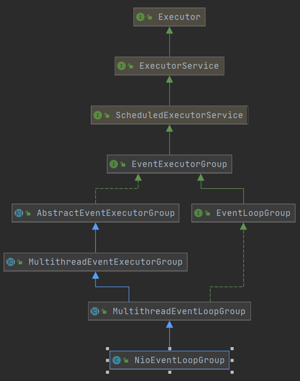

# NioEventLoop源码分析

前面几期带大家分析了Netty的服务端启动，客户端连接，客户端消息处理的流程，本期就来讲解Netty中一个极其重要的组件，事件循环器EventLoop。

### NioEventLoopGroup分析

我们平常使用Netty的时候，一般都是用NioEventLoopGroup进行操作，所以我们从NioEventLoopGroup开始分析。首先来看一下NioEventLoopGroup的继承体系



从上图可以看出NioEventLoopGroup是一个线程池，所以有一个execute()方法，并且实现了ScheduledExecutorService接口，说明它还可以执行一些调度任务。但是去看它自身和它的父类的源码，可以发现它并没持有真正的线程资源，而是由NioEventLoop持有。因为NioEventLoopGroup内部管理了多个NioEventLoop，所以我觉得把NioEventLoopGroup叫做线程组会更好理解一些。我们还是先从NioEventLoopGroup的构造开始分析。

#NioEventLoopGroup

```java
	//无参构造
	public NioEventLoopGroup() {
        this(0);
    }
	
	//创建的NioEventLoop个数，也就是线程数
	public NioEventLoopGroup(int nThreads) {
        this(nThreads, (Executor) null);
    }
	
	public NioEventLoopGroup(int nThreads, Executor executor) {
        //传了一个null的executor，还有一个selector的提供器
        this(nThreads, executor, SelectorProvider.provider());
    }

	public NioEventLoopGroup(
            int nThreads, Executor executor, final SelectorProvider selectorProvider) {
        //多传了一个选择策略
        this(nThreads, executor, selectorProvider, DefaultSelectStrategyFactory.INSTANCE);
    }

	public NioEventLoopGroup(int nThreads, Executor executor, final SelectorProvider selectorProvider,
                             final SelectStrategyFactory selectStrategyFactory) {
        //多传了一个拒绝策略(线程池的拒绝策略)，并调用父类的构造
        super(nThreads, executor, selectorProvider, selectStrategyFactory, RejectedExecutionHandlers.reject());
    }
```

#MultithreadEventLoopGroup

```java
	protected MultithreadEventLoopGroup(int nThreads, Executor executor, Object... args) {
        //将线程数设置为cpu核数*2，并且将前面的参数传给父类构造
        super(nThreads == 0 ? DEFAULT_EVENT_LOOP_THREADS : nThreads, executor, args);
    }
```

#MultithreadEventExecutorGroup

```java
	protected MultithreadEventExecutorGroup(int nThreads, Executor executor, Object... args) {
        //多传了一个选择器工厂
        this(nThreads, executor, DefaultEventExecutorChooserFactory.INSTANCE, args);
    }
	
	//到这里构造算是调用完了，总结一下都传了哪些参数
	//1. nThreads 线程数
	//2. executor 执行器 (目前是null)
	//3. chooserFactory 选择器工厂
	//4. args 将之前的参数包装成对象数组了
	//   args[0] selectorProvider  选择器提供器
    //	 args[1] selectStrategyFactory 选择策略工厂
	//	 args[2] RejectedExecutionHandlers.reject() 拒绝策略
	protected MultithreadEventExecutorGroup(int nThreads, Executor executor,
                                            EventExecutorChooserFactory chooserFactory, Object... args) {
        if (nThreads <= 0) {
            throw new IllegalArgumentException(String.format("nThreads: %d (expected: > 0)", nThreads));
        }
        
		//从构造链路来看是null
        if (executor == null) {
            //下面会讲到这个
            executor = new ThreadPerTaskExecutor(newDefaultThreadFactory());
        }

        //创建管理EventLoop的数组
        children = new EventExecutor[nThreads];

        for (int i = 0; i < nThreads; i ++) {
            boolean success = false;
            try {
                //创建NioEventLoop
                children[i] = newChild(executor, args);
                success = true;
            } catch (Exception e) {
                throw new IllegalStateException("failed to create a child event loop", e);
            } finally {
                //只要有一个创建失败，其他的都要关闭
                if (!success) {
                    for (int j = 0; j < i; j ++) {
                        children[j].shutdownGracefully();
                    }

                    for (int j = 0; j < i; j ++) {
                        EventExecutor e = children[j];
                        try {
                            while (!e.isTerminated()) {
                                e.awaitTermination(Integer.MAX_VALUE, TimeUnit.SECONDS);
                            }
                        } catch (InterruptedException interrupted) {
                            Thread.currentThread().interrupt();
                            break;
                        }
                    }
                }
            }
        }
		
        //选择器工厂创建选择器
        //选择器的作用就是通过不同的算法，从children中选出来一个NioEventLoop
        //具体算法可以去看下#DefaultEventExecutorChooserFactory，默认实现了两种
        chooser = chooserFactory.newChooser(children);

        //终止监听器
        final FutureListener<Object> terminationListener = new FutureListener<Object>() {
            @Override
            public void operationComplete(Future<Object> future) throws Exception {
                if (terminatedChildren.incrementAndGet() == children.length) {
                    terminationFuture.setSuccess(null);
                }
            }
        };

        //为每一个NioEventLoop添加监听
        for (EventExecutor e: children) {
            e.terminationFuture().addListener(terminationListener);
        }

        Set<EventExecutor> childrenSet = new LinkedHashSet<EventExecutor>(children.length);
        Collections.addAll(childrenSet, children);
        readonlyChildren = Collections.unmodifiableSet(childrenSet);
    }
```

从上面的构造我们挑出以下两行做为重点

```java
executor = new ThreadPerTaskExecutor(newDefaultThreadFactory());
//......
children[i] = newChild(executor, args);
```

首先来看newDefaultThreadFactory()

```java
	protected ThreadFactory newDefaultThreadFactory() {
        //返回了一个默认的线程工厂
        return new DefaultThreadFactory(getClass());
    }
```

再去看#ThreadPerTaskExecutor

```java
public final class ThreadPerTaskExecutor implements Executor {
    //持有默认线程工厂的引用
    private final ThreadFactory threadFactory;

    public ThreadPerTaskExecutor(ThreadFactory threadFactory) {
        this.threadFactory = ObjectUtil.checkNotNull(threadFactory, "threadFactory");
    }

    @Override
    public void execute(Runnable command) {
        //每执行一个任务，就会创建一个线程
        threadFactory.newThread(command).start();
    }
}
```

这个newThread()就是在#DefaultThreadFactory里

```java
	@Override
    public Thread newThread(Runnable r) {
        Thread t = newThread(FastThreadLocalRunnable.wrap(r), prefix + nextId.incrementAndGet());
        try {
            if (t.isDaemon() != daemon) {
                t.setDaemon(daemon);
            }

            if (t.getPriority() != priority) {
                t.setPriority(priority);
            }
        } catch (Exception ignored) {
        }
        return t;
    }

	protected Thread newThread(Runnable r, String name) {
        //创建的线程类型是FastThreadLocalThread
        return new FastThreadLocalThread(threadGroup, r, name);
    }
```

到这里我们知道了executor内部保存了一个线程工厂，并且提交一个任务就会创建一个线程。

再来看看**children[i] = newChild(executor, args);**的源码，将刚刚赋值好的executor和args都传了进去。

#NioEventLoopGroup

```java
	@Override
    protected EventLoop newChild(Executor executor, Object... args) throws Exception {
        //我们分析的构造链路，args只有3个参数，所以queueFactory也为null
        EventLoopTaskQueueFactory queueFactory = args.length == 4 ? (EventLoopTaskQueueFactory) args[3] : null;
        //将参数传入NioEventLoop构造，并创建对象
        return new NioEventLoop(this, executor, (SelectorProvider) args[0],
            ((SelectStrategyFactory) args[1]).newSelectStrategy(), (RejectedExecutionHandler) args[2], queueFactory);
    }
```

到这里，NioEventLoopGroup的流程就已经走完了，我们知道了NioEventLoopGroup中保存了一个NioEventLoop的数组，还保存了一个选择器(用来选出NioEventLoop)。接下来是分析NioEventLoop的时候了。

### NioEventLoop分析

还是先来看看NioEventLoop的继承体系


可以发现，NioEventLoop是一个单线程的线程池，我们从构造开始看。

```java
	//parent：nioEventLoopGroup
    //executor：ThreadPerTaskExecutor 内部持有默认的线程工厂
	//selectorProvider：选择器提供器
	//strategy：选择策略
	//rejectedExecutionHandler：拒绝策略
	//queueFactory：null
	NioEventLoop(NioEventLoopGroup parent, Executor executor, SelectorProvider selectorProvider,
                 SelectStrategy strategy, RejectedExecutionHandler rejectedExecutionHandler,
                 EventLoopTaskQueueFactory queueFactory) {
        //继续传向父类构造,newTaskQueue()创建队列
        super(parent, executor, false, newTaskQueue(queueFactory), newTaskQueue(queueFactory),
                rejectedExecutionHandler);
		
        this.provider = ObjectUtil.checkNotNull(selectorProvider, "selectorProvider");
        this.selectStrategy = ObjectUtil.checkNotNull(strategy, "selectStrategy");

        //下面这三行代码 ，创建出来了 seletor实例，也就是说每个 NioEventLoop都持有一个seletor实例。
        final SelectorTuple selectorTuple = openSelector();
        this.selector = selectorTuple.selector;
        this.unwrappedSelector = selectorTuple.unwrappedSelector;
    }
```

#SingleThreadEventLoop

```java
	protected SingleThreadEventLoop(EventLoopGroup parent, Executor executor,
          boolean addTaskWakesUp, Queue<Runnable> taskQueue, Queue<Runnable> tailTaskQueue,
          RejectedExecutionHandler rejectedExecutionHandler) {
        //taskQueue：任务队列
        super(parent, executor, addTaskWakesUp, taskQueue, rejectedExecutionHandler);
        //不是重点
        tailTasks = ObjectUtil.checkNotNull(tailTaskQueue, "tailTaskQueue");
    }
```

#SingleThreadEventExecutor

```java
protected SingleThreadEventExecutor(EventExecutorGroup parent, Executor executor,
                                        boolean addTaskWakesUp, Queue<Runnable> taskQueue,
                                        RejectedExecutionHandler rejectedHandler) {
    	//最终到#AbstractEventExecutor，仅仅是赋值parent字段，表示当前的NioEventLoop属于哪个Group
        super(parent);
    	//赋值操作
        this.addTaskWakesUp = addTaskWakesUp;
        this.maxPendingTasks = DEFAULT_MAX_PENDING_EXECUTOR_TASKS;
    	//在MultithreadEventExecutorGroup构造中创建的ThreadPerTaskExecutor，下面会用到，别忘了!
        this.executor = ThreadExecutorMap.apply(executor, this);
        this.taskQueue = ObjectUtil.checkNotNull(taskQueue, "taskQueue");
        this.rejectedExecutionHandler = ObjectUtil.checkNotNull(rejectedHandler, "rejectedHandler");
    }
```

到这里我们可以知道，NioEventLoop内部持有一个Selector，一个任务队列，还有一个ThreadPerTaskExecutor类型的线程池。在NioEventLoop的父类SingleThreadEventExecutor中还持有了Thread的引用，但到目前为止，我们都还没有看到线程是如何被创建出来的。还记得在前面几期里提到NioEventLoop执行的那些任务吗？它们都是通过NioEventLoop的execute()去提交任务，所以现在我们去看看execute()方法。

NioEventLoop的execute()方法是在它的父类SingleThreadEventExecutor中实现

#SingleThreadEventExecutor

```java
	@Override
    public void execute(Runnable task) {
        ObjectUtil.checkNotNull(task, "task");
        execute(task, !(task instanceof LazyRunnable) && wakesUpForTask(task));
    }
	
	private void execute(Runnable task, boolean immediate) {
        //注意！！！
        //在第一期Netty服务端启动流程里，是主线程调用的此方法，所以inEventLoop是false
        boolean inEventLoop = inEventLoop();
        //向任务队列添加一个任务
        addTask(task);
        //主线程调用，所以进入
        if (!inEventLoop) {
            //核心方法
            startThread();
            //关闭状态就进入拒绝逻辑
            if (isShutdown()) {
                boolean reject = false;
                try {
                    if (removeTask(task)) {
                        reject = true;
                    }
                } catch (UnsupportedOperationException e) {
                }
                if (reject) {
                    reject();
                }
            }
        }
        if (!addTaskWakesUp && immediate) {
            wakeup(inEventLoop);
        }
    }

	private void startThread() {
        if (state == ST_NOT_STARTED) {
            if (STATE_UPDATER.compareAndSet(this, ST_NOT_STARTED, ST_STARTED)) {
                boolean success = false;
                try {
                    doStartThread();
                    success = true;
                } finally {
                    if (!success) {
                        STATE_UPDATER.compareAndSet(this, ST_STARTED, ST_NOT_STARTED);
                    }
                }
            }
        }
    }

	//核心方法
	private void doStartThread() {
        assert thread == null;
        //executor：ThreadPerTaskExecutor
        //内部持有一个默认线程工厂，调用execute()就会创建一个线程
        executor.execute(new Runnable() {
            @Override
            public void run() {
                //将当前线程赋值给thread
                //这时NioEventLoop内部持有线程了
                thread = Thread.currentThread();
                if (interrupted) {
                    thread.interrupt();
                }
                boolean success = false;
                updateLastExecutionTime();
                try {
                    //重点来了!!!
                    //该线程调用了SingleThreadEventExecutor的run()
                    //目前的实现类是NioEventLoop，所以会调用到NioEventLoop的run()
                    SingleThreadEventExecutor.this.run();
                    success = true;
                } catch (Throwable t) {
                    logger.warn("Unexpected exception from an event executor: ", t);
                } finally {
                    //......
                }
            }
        });
    }
```

看到这里终于清楚了，绕了一个大弯，最终还是调用到了NioEventLoop的run()方法去了，前面几期说到过，NioEventLoop的run()就是核心，在里面会处理各种任务(io事件，用户提交的任务)。所以我们直接看run()。

### NioEventLoop的run()

这里的源码非常多，我们也是挑重点来讲。

```java
	@Override
    protected void run() {
        //epoll bug的一个特征计数变量。后面会解释
        int selectCnt = 0;
        for (;;) {
            try {
                // 1. >=0  表示 selector的返回值，注册在多路复用器上 就绪的 个数。
                // 2. <0 常量状态：CONTINUE  BUSY_WAIT  SELECT
                int strategy;
                try {
                    //selectStrategy：DefaultSelectStrategy对象。
                    // 根据当前NioEventLoop 是否有本地任务，来决定怎么处理。
                    // 1.有任务，那么调用多路复用器的 selectNow() 方法，返回多路复用器上就绪channel个数。
                    // 2.没有任务，返回 -1 ，下面会根据常量再进行相应的逻辑。
                    strategy = selectStrategy.calculateStrategy(selectNowSupplier, hasTasks());
                    switch (strategy) {
                        //-2
                        case SelectStrategy.CONTINUE:
                            continue;
						//-3
                        case SelectStrategy.BUSY_WAIT:

                        //-1
                        case SelectStrategy.SELECT:
                            
                            //因为NioEventLoop实现了ScheduledExecutorService，所以也可以执行调度任务
                            //获可调度任务执行截止时间，没有任务返回-1
                            long curDeadlineNanos = nextScheduledTaskDeadlineNanos();

                            if (curDeadlineNanos == -1L) {
                                //EventLoop内没有需要周期性执行的任务。
                                //设置成long最大值。
                                curDeadlineNanos = NONE; // nothing on the calendar
                            }
                            nextWakeupNanos.set(curDeadlineNanos);
                            try {
                                //判断是否有任务需要执行
                                if (!hasTasks()) {
                                    //没有本地普通任务需要执行。
                                    // 1.curDeadlineNanos long最大值，说明没有周期性任务的情况。
                                    // 2.curDeadlineNanos 表示周期性任务需要执行的截止时间。
                                    // 最终 strategy 表示 就绪的 ch 事件个数。
                                    strategy = select(curDeadlineNanos);
                                }
                            } finally {
                                nextWakeupNanos.lazySet(AWAKE);
                            }
                        default:
                    }
                } catch (IOException e) {
                    rebuildSelector0();
                    selectCnt = 0;
                    handleLoopException(e);
                    continue;
                }
                
                //epoll bug计数变量++
                selectCnt++;
                cancelledKeys = 0;
                needsToSelectAgain = false;

                //线程处理IO事件的时间占比，默认是50%。
                final int ioRatio = this.ioRatio;
                //表示本轮线程有没有处理过本地任务。
                boolean ranTasks;

                //占比为100，说明IO优先，IO处理完之后，再处理本地任务。
                if (ioRatio == 100) {
                    try {
                        if (strategy > 0) {
                            //当前NioEventLoop的selector上 有就绪的 ch 事件。
                            //处理IO事件的方法入口。看过前面两期的朋友应该有影响
                            processSelectedKeys();
                        }
                    } finally {
                        //IO事件执行完后，执行本地任务队列内的任务。
                        ranTasks = runAllTasks();
                    }

                }
                //占比不是100，当前NioEventLoop内的selector上有就绪的事件。
                else if (strategy > 0) {
                    // IO 事件处理的开始时间。
                    final long ioStartTime = System.nanoTime();
                    try {
                        //处理IO事件
                        processSelectedKeys();
                    } finally {
                        //IO事件处理总耗时。
                        final long ioTime = System.nanoTime() - ioStartTime;
                        //ioTime*(100 - ioRatio)/ioRatio 根据IO时间计算出一个执行本地队列任务的最大时间。
                        ranTasks = runAllTasks(ioTime * (100 - ioRatio) / ioRatio);
                    }
                }
                //当前NioEventLoop内的selector上没有就绪的事件，只处理本地任务就可以了。
                else {
                    // 执行最少数量的 本地任务.. 最多 最多 执行 64 个任务。
                    ranTasks = runAllTasks(0); // This will run the minimum number of tasks
                }

                if (ranTasks || strategy > 0) {
                    //......
                    //正常NioEventLoop线程从selector多路复用器上唤醒后工作是因为有io事件。
                    //会把selectCnt置为0。
                    selectCnt = 0;
                } else if (unexpectedSelectorWakeup(selectCnt)) {
                    selectCnt = 0;
                }
            } catch (CancelledKeyException e) {
                //......
            } catch (Throwable t) {
                handleLoopException(t);
            }
            try {
                if (isShuttingDown()) {
                    closeAll();
                    if (confirmShutdown()) {
                        return;
                    }
                }
            } catch (Throwable t) {
                handleLoopException(t);
            }
        }
    }
```

整个方法看下来，NioEventLoop内的线程一直在for(;;)里面自旋，分别要处理Io事件和任务队列的任务。对于处理IO事件的

processSelectedKeys()方法，在处理客户端连接流程那一章开头分析过，没看过或忘记了的可以再去看看。在这里主要分析一下处理任务队列的方法runAllTasks()，和带有运行时间的runAllTasks(long timeoutNanos)这两个方法。

#SingleThreadEventExecutor

```java
	protected boolean runAllTasks() {
        assert inEventLoop();
        boolean fetchedAll;
        boolean ranAtLeastOne = false;

        do {
            //fetchedAll：是否拿出所有的调度任务，没有的话，下一轮循环继续
            fetchedAll = fetchFromScheduledTaskQueue();
            //执行普通任务队列的任务
            if (runAllTasksFrom(taskQueue)) {
                ranAtLeastOne = true;
            }
        } while (!fetchedAll); // keep on processing until we fetched all scheduled tasks.

        //至少处理了一个任务
        if (ranAtLeastOne) {
            //设置一下最后执行时间
            lastExecutionTime = ScheduledFutureTask.nanoTime();
        }
        //执行tailTasks队列的方法，比较少见
        afterRunningAllTasks();
        return ranAtLeastOne;
    }

	private boolean fetchFromScheduledTaskQueue() {
        //队列是空直接返回
        if (scheduledTaskQueue == null || scheduledTaskQueue.isEmpty()) {
            return true;
        }
        //获取当前时间
        long nanoTime = AbstractScheduledEventExecutor.nanoTime();
        //循环的从调度队列取出任务，放入普通任务队列
        for (;;) {
            //pollScheduledTask()：从调度任务队列取一个已经到截止时间的调度任务，并且从调度队列中移除这个任务
            Runnable scheduledTask = pollScheduledTask(nanoTime);
            if (scheduledTask == null) {
                return true;
            }
            //将调度任务添加到普通任务队列
            if (!taskQueue.offer(scheduledTask)) {
                //添加失败，说明普通任务队列已满，要将此任务重新放回到调度任务队列
                scheduledTaskQueue.add((ScheduledFutureTask<?>) scheduledTask);
                return false;
            }
        }
    }

	protected final boolean runAllTasksFrom(Queue<Runnable> taskQueue) {
        //从普通任务队列取一个任务
        Runnable task = pollTaskFrom(taskQueue);
        //第一个任务为null，说明队列为空
        if (task == null) {
            //快速失败，这种思想在AQS的节点入队里可以看到
            return false;
        }
        //自旋，处理任务队列中的任务
        for (;;) {
            //安全的执行每一个任务
            safeExecute(task);
            //取出下一个任务
            task = pollTaskFrom(taskQueue);
            if (task == null) {
                //队列为空，所有任务处理完毕
                return true;
            }
        }
    }
```

以上是无参runAllTasks()方法的分析，就是将调度队列的任务移除并加入到普通任务队列中，然后循环并处理普通任务队列中所有的任务。接下来再看看带有运行时间的runAllTasks(long timeoutNanos)。

#SingleThreadEventExecutor

```java
	//timeoutNanos：最多执行该纳秒
	protected boolean runAllTasks(long timeoutNanos) {
        //将调度队列的任务移除并添加到普通任务队列
        fetchFromScheduledTaskQueue();
        Runnable task = pollTask();
        if (task == null) {
            //快速失败，并执行tailTasks队列的方法，比较少见
            afterRunningAllTasks();
            return false;
        }
		//计算处理任务的截止时间
        final long deadline = timeoutNanos > 0 ? ScheduledFutureTask.nanoTime() + timeoutNanos : 0;
        //处理的任务数量
        long runTasks = 0;
        long lastExecutionTime;
        for (;;) {
            //安全执行任务
            safeExecute(task);
            //处理任务数++
            runTasks ++;
            
            //0X3F：111111  十进制为63
            //什么数 & 63 为0 ?
            // 1000000 & 111111  64
            //10000000 & 111111  128
            //11000000 & 111111  192 ...
            //64的倍数 & 63 为0，说明每执行64个任务后，该条件会成立
            if ((runTasks & 0x3F) == 0) {
                //更新最后执行时间
                lastExecutionTime = ScheduledFutureTask.nanoTime();
                //如果最后执行时间超过执行此方法的截止时间，有两种情况
                //1. timeoutNanos不为0，那么会执行到截止时间
                //2. timeoutNanos为0，那么最多只会执行64个任务
                if (lastExecutionTime >= deadline) {
                    //退出循环
                    break;
                }
            }
			
            //取下一个任务
            task = pollTask();
            if (task == null) {
                //为null就更新时间
                lastExecutionTime = ScheduledFutureTask.nanoTime();
                break;
            }
        }
		//执行tailTasks队列的方法，比较少见
        afterRunningAllTasks();
        //将最后执行时间赋值给成员属性
        this.lastExecutionTime = lastExecutionTime;
        return true;
    }
```

从这个方法可以看出有两个分支，分别是timeoutNanos是否为0的两种情况，在NioEventLoop的run()方法中也可以找到这两个分支。在runAllTasks(long timeoutNanos)方法内，每执行64个任务就会进行一次判断，看执行普通任务是否超时，除了这一判断，对任务的处理和runAllTasks()基本一致。

以上就是NioEventLoop执行普通任务的逻辑，难度不是很大，没有理清的朋友可以再去梳理一遍流程。

在NioEventLoop的run()内，我们还留了一个问题没有解释，就是selectCnt变量，是用来处理epoll bug的。下面就对这个问题进行讲解。

### Netty解决epoll bug

我们再来看看run()方法，这次只注释了跟epoll bug有关的代码

```java
@Override
    protected void run() {
        // epoll bug 计数变量。
        int selectCnt = 0;
        for (;;) {
            try {
                int strategy;
                try {
                    strategy = selectStrategy.calculateStrategy(selectNowSupplier, hasTasks());
                    switch (strategy) {
                        case SelectStrategy.CONTINUE:
                            continue;

                        case SelectStrategy.BUSY_WAIT:

                        case SelectStrategy.SELECT:
                            long curDeadlineNanos = nextScheduledTaskDeadlineNanos();
                            if (curDeadlineNanos == -1L) {
                                curDeadlineNanos = NONE;
                            }
                            nextWakeupNanos.set(curDeadlineNanos);
                            try {
                                if (!hasTasks()) {
                                    //正常来说，没有任务或者IO事件时，线程会在此处阻塞
                                    //直到有就绪的channel，或者到了调度任务的截止时间才会唤醒
                                    //如果触发epoll bug，selector.select()在没有channel就绪时也会被唤醒
                                    //导致线程一直在for(;;)里面空轮询，cpu使用率100%
                                    strategy = select(curDeadlineNanos);
                                }
                            } finally {
                                nextWakeupNanos.lazySet(AWAKE);
                            }
                        default:
                    }
                } catch (IOException e) {
                    //IO异常也重建selector，下面会说到
                    rebuildSelector0();
                    selectCnt = 0;
                    handleLoopException(e);
                    continue;
                }
                
                //epoll bug 计数变量
                //正常来说，线程没有在上面的select()里面阻塞住，说明是有任务要执行
                //但是如果没有任务执行，线程就会一直空轮询，然后对selectCnt++
                //所以触发bug后，selectCnt在短时间内会变的很大
                selectCnt++;
                cancelledKeys = 0;
                needsToSelectAgain = false;
                final int ioRatio = this.ioRatio;
                
                //是否执行了任务，执行了为true，没有执行为false
                //这是为了判断有普通任务需要执行的情况
                //因为普通任务可能执行时间非常短，然后导致线程一直自旋，selectCnt也会累加的很大
                boolean ranTasks;
                
                if (ioRatio == 100) {
                    try {
                        if (strategy > 0) {
                            processSelectedKeys();
                        }
                    } finally {
                        //ranTasks赋值
                        ranTasks = runAllTasks();
                    }
                }
                else if (strategy > 0) {
                    final long ioStartTime = System.nanoTime();
                    try {
                        processSelectedKeys();
                    } finally {
                        final long ioTime = System.nanoTime() - ioStartTime;
                        //ranTasks赋值
                        ranTasks = runAllTasks(ioTime * (100 - ioRatio) / ioRatio);
                    }


                }
                else {
                    //ranTasks赋值
                    ranTasks = runAllTasks(0);
                }

                //ranTasks判断，执行了普通任务条件一定成立
                if (ranTasks || strategy > 0) {
                    //MIN_PREMATURE_SELECTOR_RETURNS=3
                    //可能是调度任务截止时间没差很远，在短时间内selector.select()唤醒了好几次
                    //仅仅打印一下日志
                    if (selectCnt > MIN_PREMATURE_SELECTOR_RETURNS && logger.isDebugEnabled()) {
                        logger.debug("Selector.select() returned prematurely {} times in a row for Selector {}.",
                                selectCnt - 1, selector);
                    }
                    //到这里说明执行了IO事件或者普通任务，判断selector没有出现epoll bug，
                    //将selectCnt归0
                    selectCnt = 0;
                    
                //如果进入下面这个if分支
                //ranTasks为false，没有执行过普通任务
                //strategy<=0 说明selector上没有就绪channel，但没有被selector.select()阻塞
                //进去看unexpectedSelectorWakeup(selectCnt)
                } else if (unexpectedSelectorWakeup(selectCnt)) {
                    //将属性重新赋值
                    selectCnt = 0;
                }
            } catch (CancelledKeyException e) {
                if (logger.isDebugEnabled()) {
                    logger.debug(CancelledKeyException.class.getSimpleName() + " raised by a Selector {} - JDK bug?",
                            selector, e);
                }
            } catch (Throwable t) {
                handleLoopException(t);
            }
            try {
                if (isShuttingDown()) {
                    closeAll();
                    if (confirmShutdown()) {
                        return;
                    }
                }
            } catch (Throwable t) {
                handleLoopException(t);
            }
        }
    }

	private boolean unexpectedSelectorWakeup(int selectCnt) {
        //线程被中断，不是重点
        if (Thread.interrupted()) {
            if (logger.isDebugEnabled()) {
                logger.debug("Selector.select() returned prematurely because " +
                        "Thread.currentThread().interrupt() was called. Use " +
                        "NioEventLoop.shutdownGracefully() to shutdown the NioEventLoop.");
            }
            return true;
        }
        //SELECTOR_AUTO_REBUILD_THRESHOLD：默认值是512
 		//如果selectCnt>=512，Netty就认为触发了epoll bug
        if (SELECTOR_AUTO_REBUILD_THRESHOLD > 0 &&
                selectCnt >= SELECTOR_AUTO_REBUILD_THRESHOLD) {
            logger.warn("Selector.select() returned prematurely {} times in a row; rebuilding Selector {}.",
                    selectCnt, selector);
            //重建Selector
            rebuildSelector();
            return true;
        }
        return false;
    }

	public void rebuildSelector() {
        //正常流程是在EventLoop线程发生
        if (!inEventLoop()) {
            execute(new Runnable() {
                @Override
                public void run() {
                    rebuildSelector0();
                }
            });
            return;
        }
        //走这个逻辑，重建selector
        rebuildSelector0();
    }

	private void rebuildSelector0() {
        //获取已经触发bug的selector
        final Selector oldSelector = selector;
        final SelectorTuple newSelectorTuple;
		
        if (oldSelector == null) {
            return;
        }

        try {
            //重新创建selector
            newSelectorTuple = openSelector();
        } catch (Exception e) {
            logger.warn("Failed to create a new Selector.", e);
            return;
        }

        
        int nChannels = 0;
        //遍历老的selector，将channel重新注册到新的selector上
        for (SelectionKey key: oldSelector.keys()) {
            //channel
            Object a = key.attachment();
            try {
                if (!key.isValid() || key.channel().keyFor(newSelectorTuple.unwrappedSelector) != null) {
                    continue;
                }
				
                //获取老的selector的感兴趣事件
                int interestOps = key.interestOps();
                //销毁
                key.cancel();
                
                //注册channel到新的selector上
                SelectionKey newKey = key.channel().register(newSelectorTuple.unwrappedSelector, interestOps, a);
                if (a instanceof AbstractNioChannel) {
                    ((AbstractNioChannel) a).selectionKey = newKey;
                }
                nChannels ++;
            } catch (Exception e) {
                logger.warn("Failed to re-register a Channel to the new Selector.", e);
                if (a instanceof AbstractNioChannel) {
                    AbstractNioChannel ch = (AbstractNioChannel) a;
                    ch.unsafe().close(ch.unsafe().voidPromise());
                } else {
                    @SuppressWarnings("unchecked")
                    NioTask<SelectableChannel> task = (NioTask<SelectableChannel>) a;
                    invokeChannelUnregistered(task, key, e);
                }
            }
        }
		
        //给NioEventLoop的字段重新赋值
        selector = newSelectorTuple.selector;
        unwrappedSelector = newSelectorTuple.unwrappedSelector;

        try {
            //关闭老的selector
            oldSelector.close();
        } catch (Throwable t) {
            if (logger.isWarnEnabled()) {
                logger.warn("Failed to close the old Selector.", t);
            }
        }

        if (logger.isInfoEnabled()) {
            logger.info("Migrated " + nChannels + " channel(s) to the new Selector.");
        }
    }
```

到这里Netty解决epoll bug的办法就讲解完成了。总结一下，在run()方法内通过两个变量，循环计数和是否处理过普通任务来进行判断，当前selector是否触发了bug，如果触发就进行重建，并将旧的selector上注册的channel重新注册到新的selector上，这样就完成了selector的重建，然后又可以继续处理IO事件或普通任务了。

以上就是NioEventLoop的源码分析，看完后我们对EventLoopGroup和EventLoop有了更深的认识。EventLoopGroup中并不保存线程实例，而是保存了一个选择器（用来选出单个EventLoop）和一个EventLoop数组。而EventLoop内部保存了线程实例，selector，普通任务队列和调度任务队列，并且会在调用execute()方法后开启线程，回调到EventLoop的run()方法内进行处理IO事件和普通任务。如果到这里还是不太清楚过程的朋友，最好打开源码按照本文的流程自行梳理几遍，相信很快就能掌握这些知识了。