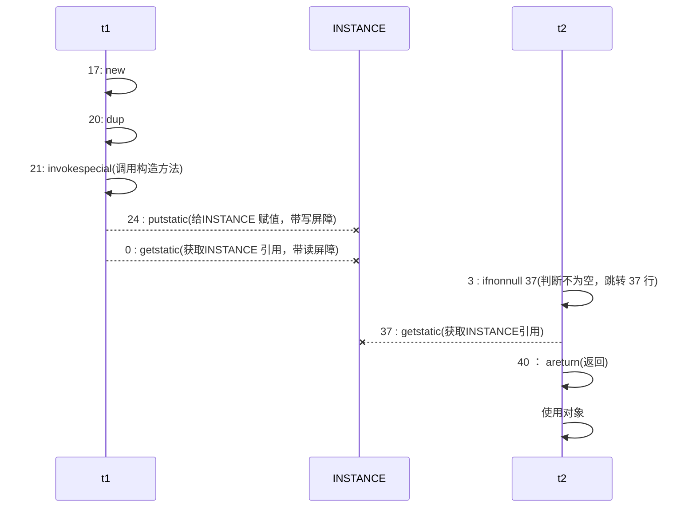

# 单例模式面试题

>单例模式有很多实现方法，饿汉、懒汉、静态内部类、枚举类，试分析每种实现下获取单例对象（即调用 getInstance）时的线程安全，并思考注释中的问题
>
>- 饿汉式：类加载就会导致该单实例对象被创建 
>- 懒汉式：类加载不会导致该单实例对象被创建，而是首次使用该对象时才会创建

## 1. 懒汉式

```java
// 问题1：为什么加 final
// 问题2：如果实现了序列化接口, 还要做什么来防止反序列化破坏单例
public final class Singleton implements Serializable {
    // 问题3：为什么设置为私有? 是否能防止反射创建新的实例?
    private Singleton() {
    }

    // 问题4：这样初始化是否能保证单例对象创建时的线程安全?
    private static final Singleton INSTANCE = new Singleton();

    // 问题5：为什么提供静态方法而不是直接将 INSTANCE 设置为 public, 说出你知道的理由
    public static Singleton getInstance() {
        return INSTANCE;
    }

    public Object readResolve() {
        return INSTANCE;
    }
    //问题6：反射也会破坏单例，如何防范反射攻击？
}
```

- 问题1：防止子类中不适当的方法覆盖父类的方法破坏单例

- 问题2：在java中除了可以通过new关键字创建一个对象外，还可以通过反射、clone()、反序列化的方式创建对象。如果通过反序列化生成了对象，就不能维护单例了。我们可以通过以下代码防止反序列化破坏单例

  ```java
  //当用反序列化创建对象时，会调用readResolve()，因此我们直接给它重写，让它返回我们创建的对象就行了
  public Object readResolve() {
       return INSTANCE;
  }
  ```

- 问题3：防止通过构造器创建实例。不能防止，如以下代码就可以通过反射拿到构造器并创建实例

  ```java
  public class AttackSingleton {
      public static void main(String[] args) throws Exception {
          Class<?> clazz = Class.forName("com.xxx.Singleton");
          Class<?>[] clazzs = clazz.getDeclaredClasses();
          for(Class<?> c : clazzs){
              Constructor<?> constructor = c.getConstructor();
              Object o = constructor.newInstance();
              System.out.println(o);
              ((Singleton)o).showInfo();
          }
      }
  }
  ```

- 问题4：没有，静态成员变量的初始化都是在类加载的时候完成的，由JVM保证线程安全性

- 问题5：更好的封装，能够在封装的方法中做一些其他的操作，例如惰性加载；泛型的支持；更好的控制

- 问题6：可以将单例类声明成抽象类，抽象类的构造器不具备创建对象的功能，所以反射也无法突破限制。那么本类如何创建单例对象呢？可以使用抽象类的引用指向匿名子类的实例，匿名子类中什么都不需要写

  ```java
  public abstract class Singleton {
      private Singleton() { }
      private static Singleton INSTANCE = null;
      public static Singleton getInstance() {
          if(INSTANCE == null) { // t2
              // 首次访问会同步，而之后的使用没有 synchronized
              synchronized(Singleton.class) {
                  if (INSTANCE == null) { // t1
                      INSTANCE = new xxx();
                  }
              }
          }
          return INSTANCE;
      }
      private static class xxx extends Singleton{ }
  }
  ```

## 2. 枚举式

**JDK 版本：**JDK1.5 起

**是否 Lazy 初始化：**否

**是否多线程安全：**是

**实现难度：**易

**描述：**这种实现方式还没有被广泛采用，但这是实现**单例模式的最佳方法**。它更简洁，自动支持序列化机制，绝对防止多次实例化。
这种方式是 Effective Java 作者 Josh Bloch 提倡的方式，它不仅能避免多线程同步问题，而且还自动支持序列化机制，防止反序列化重新创建新的对象，绝对防止多次实例化。不过，由于 JDK1.5 之后才加入 enum 特性，用这种方式写不免让人感觉生疏，在实际工作中，也很少用。不能通过 reflection attack 来调用私有构造方法（防止反射攻击）

```java
// 问题1：枚举单例是如何限制实例个数的
// 问题2：枚举单例在创建时是否有并发问题
// 问题3：枚举单例能否被反射破坏单例
// 问题4：枚举单例能否被反序列化破坏单例
// 问题5：枚举单例属于懒汉式还是饿汉式
// 问题6：枚举单例如果希望加入一些单例创建时的初始化逻辑该如何做
enum Singleton { 
 INSTANCE; 
}
```

- 问题一：枚举对象定义时有几个，就会产生几个，相当于枚举类的静态成员变量

- 问题二：不会有并发变量，成员变量为静态成员变量，在类加载的时候就初始化了，由JVM保证线程安全

- 问题三：不能，因为枚举类型没有构造器不能被实例化

- 问题四：不能，我们从字节码中可以看到枚举类型`enum`继承自`java.lang.Enum`，其父类已经实现了`Serializable`接口并且默认就是反序列化的，所以说枚举单例天生防止反序列化破坏单例

  

- 问题5：饿汉式

- 问题六：枚举也可以写构造方法，可以在构造方法中进行初始化

  ```java
  public enum EnumSingleton {
      INSTANCE;
      EnumSingleton(){
          
      }
  }
  ```

## 3. 饿汉式

```java
public final class Singleton {
    private Singleton() { }
    private static Singleton INSTANCE = null;
    // 分析这里的线程安全, 并说明有什么缺点
    public static synchronized Singleton getInstance() {
        if( INSTANCE != null ){
            return INSTANCE;
        }
        INSTANCE = new Singleton();
        return INSTANCE;
    }
}
```

- 锁的范围太大，每次调用方法时都要加锁，性能开销大

## 4. 饿汉双检锁(DCL)

```java
public final class Singleton {
    private Singleton() { }
    // 问题1：解释为什么要加 volatile ?
    private static volatile Singleton INSTANCE = null;

    // 问题2：对比实现3, 说出这样做的意义 
    public static Singleton getInstance() {
        if (INSTANCE != null) {
            return INSTANCE;
        }
        synchronized (Singleton.class) {
            // 问题3：为什么还要在这里加为空判断, 之前不是判断过了吗
            if (INSTANCE != null) { // t2 
                return INSTANCE;
            }
            INSTANCE = new Singleton();
            return INSTANCE;
        }
    }
}
```

- 问题一：为了防止`synchronized`同步块中实例创建和赋值的指令重排序导致其他线程拿到不完整实例的问题，`volatile`可以防止指令重排，在写之后加一个写屏障防止写之前的代码重排序到写之后（具体过程看附录）
- 问题二：减小了锁的范围，性能更好
- 问题三：为了防止首次实例化时多线程并发的问题，即有多个线程同时判断`INSTANCE`为空后往下执行的情况，所以需要再次判断

## 5. 静态内部类式

```java
public final class Singleton {
    private Singleton() {
    }

    // 问题1：属于懒汉式还是饿汉式
    private static class LazyHolder {
        static final Singleton INSTANCE = new Singleton();
    }

    // 问题2：在创建时是否有并发问题
    public static Singleton getInstance() {
        return LazyHolder.INSTANCE;
    }
}
```

- 问题一：属于懒汉式，因为类加载本身就是懒汉式的，如果没有调用`getInstance`时，JVM是不会去加载`LazyHolder`类的
- 问题二：不会有并发问题，类加载中的线程安全是由`JVM`保证的，所以不会有并发问题

## 附录：DCL问题提出与解决

```java
public class Singleton {
    private Singleton() { }
    private static Singleton INSTANCE = null;
    public static Singleton getInstance() {
        if(INSTANCE == null) { // t2
            // 首次访问会同步，而之后的使用没有 synchronized
            synchronized(Singleton.class) {
                if (INSTANCE == null) { // t1
                    INSTANCE = new Singleton();
                }
            }
        }
        return INSTANCE;
    }
}
```

以上的实现特点是：

- 懒惰实例化 
- 首次使用 getInstance() 才使用 synchronized 加锁，后续使用时无需加锁 
- **有隐含的，但很关键的一点：第一个 if 使用了 INSTANCE 变量，是在同步块之外**

上面的代码看上去好像并没有什么问题，使用双重检测锁既防止多次进入`synchronized`耗费性能，又能有效的防止多线程下多次实例化的问题。但是其实上面的代码还是有问题的，那就是`第五行和第十三行可能会发生指令重排序`

getInstance 方法对应的字节码为：

```java
0: getstatic #2 // 对应第五行代码，获取INSTANCE变量
3: ifnonnull 37 // 判断是否为null，不为null跳转到第37行
6: ldc #3       // 因为加锁需要获得类对象，所以这里为获得类对象
8: dup          // 将类对象引用复制了一份
9: astore_0     // 将类对象的引用指针存储了一份，为了之后解锁时使用
10: monitorenter // 进入同步代码块
11: getstatic #2 // 对应第五行代码，获取INSTANCE变量
14: ifnonnull 27
17: new #3       // 生成一个INSTANCE实例
20: dup          // 复制了一份INSTANCE的实例的引用
21: invokespecial #4 // 利用上一步复制的引用调用实例的构造方法
24: putstatic #2     // 赋值给INSTANCE变量
27: aload_0        
28: monitorexit  // 退出同步块,将lock对象MarkWord重置，唤醒EntryList
29: goto 37       
32: astore_1     // e -> slot 2    异常处理开始
33: aload_0      // <- lock引用
34: monitorexit  // 退出同步代码块	
35: aload_1
36: athrow       // 将处理不了的异常抛出
37: getstatic #2 // 对应第五行代码，获取INSTANCE变量
40: areturn
```

其中我们主要需要关注的是：

- 17 表示创建对象，将对象引用入栈 // new Singleton 
- 20 表示复制一份对象引用 // 引用地址 
- 21 表示利用一个对象引用，调用构造方法 
- 24 表示利用一个对象引用，赋值给 static INSTANCE

也许 jvm 会优化为：先执行 24，再执行 21（因为INSTANCE并没有完全在`synchronized`的保护之下，所以还是可能会有重排序）

如果两个线程 t1，t2 按如下时间序列执行


关键在于 `0: getstatic` 这行代码在 monitor 控制之外，在并发场景下可能会越过 monitor 读取 INSTANCE 变量的值 这时 t1 还未完全将构造方法执行完毕，如果在构造方法中要执行很多初始化操作，那么 t2 拿到的是将是一个未初始化完毕的单例

那如何解决呢？其实很简单，对 INSTANCE 使用 volatile 修饰即可，可以禁用指令重排，但要注意在 JDK 5 以上的版本的 volatile 才会真正有效

**double-checked locking 解决**

```java
public class Singleton {
    private Singleton() { }
    private static volatile Singleton INSTANCE = null;
    public static Singleton getInstance() {
        if(INSTANCE == null) { // t2
            // 首次访问会同步，而之后的使用没有 synchronized
            synchronized(Singleton.class) {
                if (INSTANCE == null) { // t1
                    INSTANCE = new Singleton();
                }
            }
        }
        return INSTANCE;
    }
}
```

我们知道`volatile`是通过内存屏障来解决指令重排序的，Memory Barrier（Memory Fence）

具体操作为：

- 对 volatile 变量的写指令后会加入写屏障 
- 对 volatile 变量的读指令前会加入读屏障

对应字节码：

```java
// -------------------------------------> 加入对 INSTANCE 变量的读屏障
0: getstatic #2 // Field INSTANCE:Lcn/itcast/n5/Singleton;
3: ifnonnull 37
6: ldc #3 // class cn/itcast/n5/Singleton
8: dup
9: astore_0
10: monitorenter -----------------------> 保证原子性、可见性
11: getstatic #2 // Field INSTANCE:Lcn/itcast/n5/Singleton;
14: ifnonnull 27
17: new #3 // class cn/itcast/n5/Singleton
20: dup
21: invokespecial #4 // Method "<init>":()V
24: putstatic #2 // Field INSTANCE:Lcn/itcast/n5/Singleton;
// -------------------------------------> 加入对 INSTANCE 变量的写屏障
27: aload_0
28: monitorexit ------------------------> 保证原子性、可见性
29: goto 37
32: astore_1
33: aload_0
34: monitorexit
35: aload_1
36: athrow
37: getstatic #2 // Field INSTANCE:Lcn/itcast/n5/Singleton;
40: areturn    
```

如上面的注释内容所示，读写 volatile 变量时会加入内存屏障（Memory Barrier（Memory Fence）），保证下面两点：

- 可见性
  - 写屏障（sfence）保证在该屏障之前的 t1 对共享变量的改动，都同步到主存当中 
  - 而读屏障（lfence）保证在该屏障之后 t2 对共享变量的读取，加载的是主存中最新数据
- 有序性
  - 写屏障会确保指令重排序时，不会将写屏障之前的代码排在写屏障之后 
  - 读屏障会确保指令重排序时，不会将读屏障之后的代码排在读屏障之前
- 更底层是读写变量时使用 lock 指令来多核 CPU 之间的可见性与有序性




